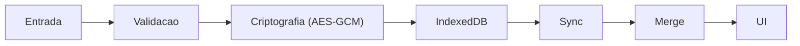
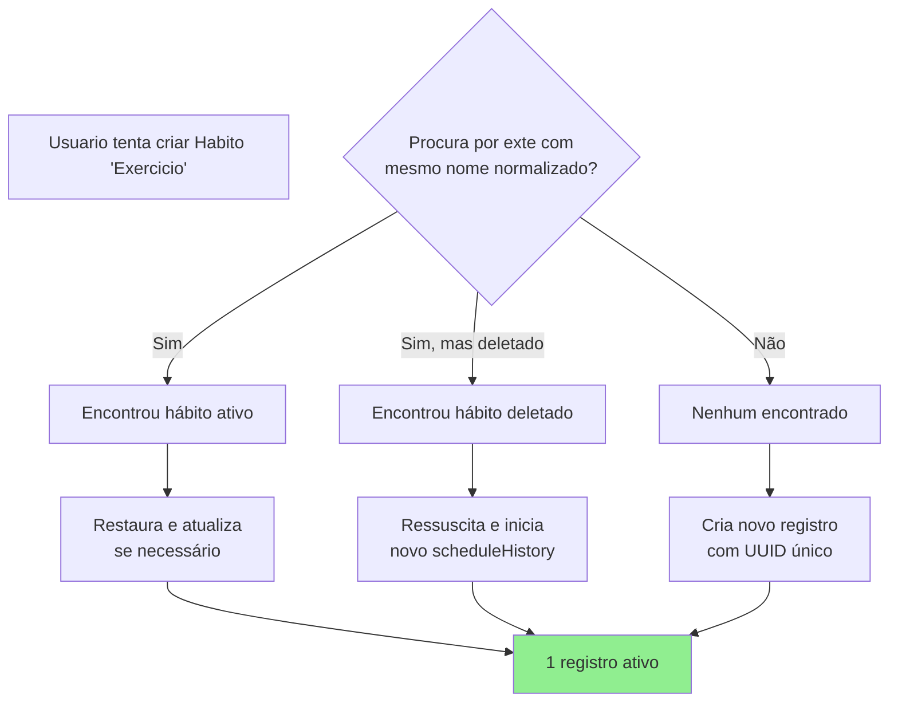
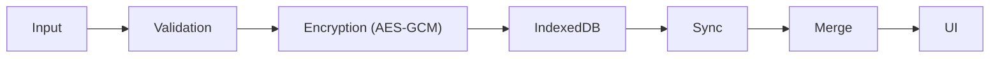
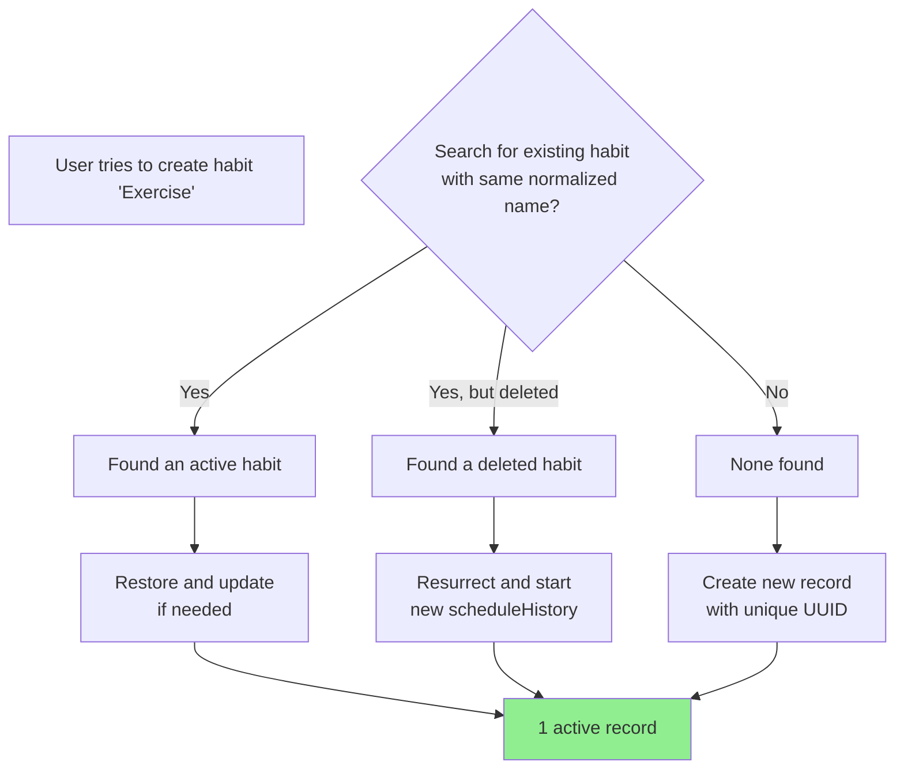
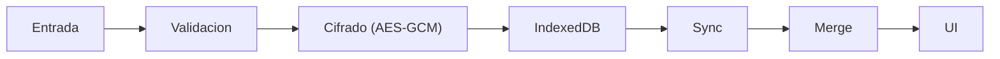
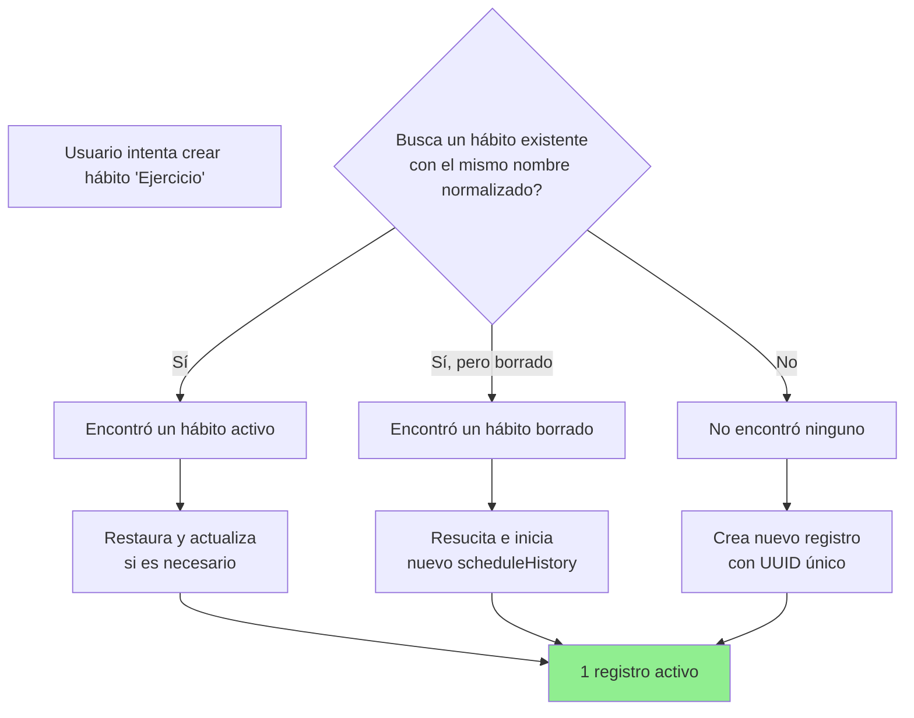

<p align="left" style="margin: 0 0 4px 0; line-height: 0;">
  <a href="#pt-br" style="text-decoration: none; border: 0;"></a>&nbsp;
  <a href="#en" style="text-decoration: none; border: 0;"></a>&nbsp;
  <a href="#es" style="text-decoration: none; border: 0;"></a>
</p>

<div align="center" style="margin-top: 0; font-size: 0; line-height: 0;">
  
  
</div>

<a id="pt-br"></a>

## PT-BR

<p align="center">
  
</p>

Epígrafe do projeto — conecta direto com o propósito do Askesis como **habit tracker**: consistência e excelência se constroem pela prática diária, e **hábitos** são o mecanismo que o app ajuda a treinar e acompanhar.


<details>
  <summary>Ver estrutura completa (TOC)</summary>

- [Visão do Projeto](#pt-visao-do-projeto)
- [IA como assistente de código e prototipação](#pt-ai-assistant)
  - [Paradigma de Construção: A Orquestração Humano-IA](#pt-build-paradigm)
- [Diferenciais](#pt-highlights)
- [Diagramas (visão geral)](#pt-diagramas)
  - [Visão Geral da Arquitetura e Fluxo do Usuário](#pt-architecture-user-flow)
  - [Visão Geral de Integrações e Infraestrutura](#pt-integrations-infra)
  - [Visão Geral do Ciclo de Dados](#pt-data-lifecycle)
- [Arquitetura Interna (Resumo)](#pt-c4-l3)
- [Fluxo de Dados (Resumo)](#pt-data-flow)
- [Fluxo de Conflito de Sync (Resumo)](#pt-sync-conflict)
- [Regras de Unicidade de Hábitos](#pt-habit-uniqueness)
- [Mapa rápido de módulos](#pt-modules-map)
- [Tecnologia](#pt-tech)
- [Estrutura do projeto](#pt-project-structure)
- [Testes e qualidade](#pt-tests-quality)
- [Desenvolvimento](#pt-development)
- [Guia completo (detalhado)](#pt-guia-completo)
- [Licenca](#pt-license)


</details>

<a id="pt-visao-do-projeto"></a>
<a id="pt-resumo"></a>

### Visão do Projeto

Rastreador de hábitos estoico, focado em privacidade, com IA para reflexões e ajustes de rotina.

#### A Motivação: Por que construir?

Ncessidade por privacidade e e a possibilidade de gerar e criar codigo por medio de IA Gen:

1. **Soberania e Privacidade de Dados:** Garantia absoluta de que as informações não seriam compartilhadas, vendidas ou analisadas por terceiros. 

2. **Tecnológia Disponivel:** Em uma era dominada por modelos de assinatura (SaaS), recusei-me pagar por um software que pode ser construído ainda melhor com ajuda da IA Gen.

#### Meu objetivo: **Privacidade por desenho + criptografia + anonimato coletivo**

No Askesis os dados pertencem exclusivamente ao usuário e residem no seu dispositivo (ou no seu cofre pessoal criptografado). Além disso, no caso da IA se adota uma prática conhecida como **anonimato coletivo** (*anonymity set*); como a app não exige identificacao o uso e os dados sao **diluídos no conjunto de usuários**. 

#### A Filosofia: O que é Askesis?

**Askesis** (do grego *ἄσκησις*) é a raiz da palavra "ascetismo", mas seu significado original é muito mais prático: significa **"treinamento"** ou **"exercício"**.

Na filosofia estoica, *askesis* não se trata de sofrimento ou privação sem sentido, mas do **treinamento rigoroso e atlético da mente e do caráter**. Assim como um atleta treina o corpo para a competição, o estoico treina a mente para lidar com as adversidades da vida com virtude e tranquilidade.

A maioria dos apps de hábitos foca em gamificação superficial ou em "não quebrar a corrente". O Askesis foca na **virtude da consistência**. Ele usa Inteligência Artificial para atuar como um "Sábio Estoico", analisando seus dados não para julgar, mas para oferecer conselhos sobre como fortalecer sua vontade.


<a id="pt-ai-assistant"></a>

### IA como assistente de código e prototipação

O Askesis não foi só “codificado”; foi **orquestrado** com IA como parceira. Usei o Google AI Studio como playground de prototipação e o GitHub Codespaces como ambiente de desenvolvimento em nuvem.

- **Papel humano:** definir visão, arquitetura e prioridades; validar o que foi gerado via iteração de prompts e testes.
- **Papel da IA:** acelerar a implementação pesada, sugerir ajustes de performance e ajudar a eliminar bugs lógicos.

O resultado é uma aplicação que uma única pessoa consegue levar a um nível de complexidade e polimento mais comum em um time.

<a id="pt-build-paradigm"></a>
<details>
  <summary>Paradigma de Construção: A Orquestração Humano-IA</summary>


Esta tabela explicita onde a IA entregou velocidade de implementação e onde minha visão de produto e formação em Psicologia transformaram código em experiência.

| Recurso | Tradicional / IA “pura” | Minha intervenção (arquiteto) | Resultado: Askesis |
|---|---|---|---|
| Privacidade | Login obrigatório e dados em nuvem comercial. | Local-first por padrão; sync opt-in; E2E com AES-GCM no cliente (em Web Worker) e sem coleta de PII. | Dados ficam no dispositivo; na rede/servidor trafega e persiste apenas ciphertext. |
| Performance | Frameworks pesados e re-renderizações custosas que adicionam latência. | Vanilla TypeScript + APIs nativas; bitmask-first/split-state; workers para tarefas CPU-bound; budgets cobertos por testes de cenário. | Budgets verificados (ex.: leituras massivas em < 50ms nos testes) e UI responsiva. |
| UX & Psicologia | Gamificação ruidosa (streaks, dopamina, competição) como padrão. | Diretriz de produto: reforçar a “virtude da consistência” com UX minimalista e feedback orientado à autorreflexão. | Menos ruído, mais aderência: o app serve ao treino mental, não à dependência. |
| Acessibilidade | A11y tratada como detalhe ou pós-facto. | Semântica HTML + ARIA, navegação por teclado e gestão de foco; validação contínua via testes de cenário de acessibilidade. | Experiência inclusiva e navegável sem mouse, com suporte prático a leitores de tela. |
| Confiabilidade | Testes unitários isolados ou baixa cobertura de falhas reais. | Suite de “super-testes” (jornada, conflitos de sync, performance, acessibilidade, segurança e disaster recovery). | Regressões detectadas cedo e comportamento resiliente sob estresse. |
| Sustentabilidade | Backend stateful, custos recorrentes e pressão por assinaturas/anúncios. | Arquitetura local-first; serverless apenas como ponte opcional; processamento pesado no dispositivo do usuário. | Infra enxuta e custo marginal baixo para escalar, sem monetização agressiva. |
</details>

<a id="pt-highlights"></a>

### Diferenciais

#### Comparação com Concorrentes

| Aspecto | Askesis | Concorrentes (ex: Habitica, Streaks, Loop) |
|---------|---------|--------------------------------------------|
| Privacidade de Dados | Local-first, E2E encryption, sem login obrigatório | Muitos exigem conta, dados centralizados na nuvem |
| Uso de IA | Reflexão filosófica (estoica), ajuste de rotina | Gamificação ou sem IA |
| Dependências Técnicas | Zero-deps no boot, opt-in para notificações | SDKs obrigatórios para funcionalidades básicas |
| Sincronização | Opcional, resiliente (CRDT-lite) | Limitada ou obrigatória com login |
| Filosofia | Foco em consistência e caráter | Recompensas, streaks, competição |
| Sustentabilidade Econômica | Custo zero de infraestrutura, processamento no dispositivo | Custos altos de servidor, assinaturas obrigatórias |

<details>
<summary>Deep Dive Técnico</summary>
<br>
O Askesis opera no "Sweet Spot" da performance web, utilizando APIs nativas modernas para superar frameworks:

---

| Aspecto | Descrição | Benefício |
|---------|-----------|-----------|
| **Arquitetura de Dados "Bitmask-First"** | Estado de hábitos em mapas de bits (`BigInt`) para verificações `O(1)` e memória mínima. | Consultas instantâneas de histórico sem impacto na performance, mesmo com anos de dados. |
| **Persistência "Split-State"** | IndexedDB separa dados quentes/frios para inicialização instantânea. | App abre em segundos, sem parsing desnecessário de dados antigos. |
| **Física de UI com APIs Avançadas** | Interações fluidas via Houdini e `scheduler.postTask` para UI sem bloqueios. | Animações suaves e responsivas, melhorando a experiência do usuário em qualquer dispositivo. |
| **Multithreading (Web Workers)** | Tarefas pesadas (cripto, parsing, IA) isoladas em workers para UI Jank-free. | Interface sempre fluida, sem travamentos durante operações intensas. |
| **Criptografia Zero-Copy** | AES-GCM off-main-thread com `ArrayBuffer` direto, eficiente em dispositivos modestos. | Segurança máxima sem sacrificar velocidade, mesmo em celulares básicos. |
| **Sincronização Inteligente (CRDT-lite)** | Resolução de conflitos com pesos semânticos, progresso sempre preservado. | Sync confiável entre dispositivos, sem perda de dados ou conflitos manuais. |

<h3>Estrutura do Projeto</h3>

```text
.
├── api/                 # Vercel Edge Functions (Backend Serverless)
├── assets/              # Imagens/flags/diagramas usados no app/README
├── css/                 # CSS modular (layout, componentes, etc.)
├── data/                # Dados estáticos (quotes, hábitos pré-definidos)
├── icons/               # Ícones (SVG) e assets relacionados
├── locales/             # Arquivos de Tradução (i18n)
├── render/              # Motor de Renderização (DOM Recycling & Templates)
├── listeners/           # Controladores de Eventos e Gestos
├── services/            # Camada de Dados, Criptografia e IO
│   ├── api.ts           # Cliente HTTP
│   ├── cloud.ts         # Orquestrador de Sync e Worker Bridge
│   ├── crypto.ts        # Criptografia AES-GCM Isomórfica
│   ├── dataMerge.ts     # Resolução de Conflitos (CRDT-lite)
│   ├── habitActions.ts  # Lógica de Negócios (ações sobre hábitos)
│   ├── migration.ts     # Migrações de schema/bitmasks
│   ├── persistence.ts   # Wrapper IndexedDB Assíncrono
│   ├── quoteEngine.ts   # Motor de seleção de citações
│   ├── selectors.ts     # Camada de leitura otimizada (memoized)
│   └── sync.worker.ts   # Web Worker para tarefas CPU-bound
├── tests/               # Testes de cenário (resiliência, performance, segurança)
├── state.ts             # Estado global (Single Source of Truth)
├── render.ts            # Facade/orquestrador de render (re-export)
├── listeners.ts         # Setup de listeners (bootstrap)
├── index.tsx            # Entry point
├── index.html           # App Shell (Critical Render Path)
└── sw.js                # Service Worker (Atomic Caching)
```

<h2>🏗️ Estrutura de Dados: A Magia por Trás</h2>

O Askesis utiliza estruturas de dados altamente otimizadas que são raramente vistas em aplicações web. Compreender essa escolha é compreender por que o app é tão rápido:

<h3>🔢 O Sistema de Bitmask 9-bit</h3>

Cada hábito é armazenado de forma comprimida usando **BigInt** (inteiros arbitrariamente grandes do JavaScript).

```
Cada dia ocupa 9 bits (para 3 períodos: Manhã, Tarde, Noite):

┌───────────────────────────────────────────────────────────────────────────────────────────────┐
│ Dia = [Tombstone(1 bit) | Status Noite(2) | Status Tarde(2) | Status Manhã(2) | Reserved(2) ] │
└───────────────────────────────────────────────────────────────────────────────────────────────┘

Estados possíveis (2 bits cada):
  00 = Pendente (não iniciado)
  01 = Feito (completed)
  10 = Adiado (deferred/snoozed)
  11 = Reservado para expansão futura

Exemplo de 1 mês (30 dias):
  - Sem compressão:   30 dias × 3 períodos × 8 bytes = 720 bytes
  - Com bitmask:      30 dias × 9 bits = 270 bits ≈ 34 bytes (21x menor!)
  - GZIP:             34 bytes → ~8 bytes comprimido
```

**Operações Bitwise O(1):**
```typescript
// Ler status de um hábito em 2025-01-15 na Manhã:
const status = (log >> ((15-1)*9 + PERIOD_OFFSET['Morning'])) & 3n;

// Escrever status:
log = (log & clearMask) | (newStatus << bitPos);

// Isso é **instantâneo** mesmo com 10+ anos de dados!
```

<h3>📦 Split-State Storage: JSON + Binary</h3>

O IndexedDB do Askesis armazena dados em **duas colunas separadas**:

```
┌──────────────────────────────────────────┐
│ IndexedDB (AskesisDB)                    │
├──────────────────────────────────────────┤
│ KEY: "askesis_core_json"                 │
│ VALUE: {                                 │
│   version: 9,                            │
│   habits: [Habit[], ...],                │
│   dailyData: Record<>,                   │
│   ... (tudo exceto monthlyLogs)          │
│ }                                        │
│ SIZE: ~50-200 KB (mesmo com 5 anos)      │
├──────────────────────────────────────────┤
│ KEY: "askesis_logs_binary"               │
│ VALUE: {                                 │
│   "habit-1_2024-01": "a3f4e8c...",       │ ← Hex string (9-bit logs)
│   "habit-1_2024-02": "b2e5d1a...",       │
│   ...                                    │
│ }                                        │
│ SIZE: ~8-15 KB (mesmo com 5 anos)        │
└──────────────────────────────────────────┘
```

**Benefícios:**
- **Startup instantâneo:** JSON carrega em < 50ms, binários sob demanda
- **Backup eficiente:** Exportar dados = apenas o JSON (< 200 KB)
- **Migração segura:** Versiones antigas + novas coexistem sem conflitos

<h3>🔗 Tombstone Pattern: Soft Delete com Segurança de Sync</h3>

Quando você deleta um hábito, o Askesis **não o apaga**. Em vez disso, marca com um "Túmulo" (Tombstone):

```
┌───────────────────────────────────────┐
│ DELETE HABITO 'Meditar'               │
├───────────────────────────────────────┤
│ 1. Ao invés de: habits.remove(id)     │
│    Faz:         habit.deletedOn = now │
│                                       │
│ 2. Marca no bitmask:                  │
│    Bit 8 (Tombstone) = 1              │
│    (Força todos os bits para 0)       │
│                                       │
│ 3. Benefit:                           │
│    - Se sync não chegou a outro app,  │
│      ele recebe DELETE + Sincroniza   │
│    - Histórico preservado para backup │
│    - Undo é possível (re-ativar)      │
└───────────────────────────────────────┘
```

**Exemplo real:**
```typescript
// Usuário deleta 'Meditar' em 2025-02-01
habitActions.requestHabitPermanentDeletion('habit-123');

// No bitmask, 2025-02-01 vira:
// 100 | 00 | 00 | 00 | 00 = 4 (Tombstone ativo)

// Ao sincronizar com outro dispositivo:
// 1. Servidor recebe tombstone bit
// 2. Propaga DELETE para todos os clientes
// 3. Histórico anterior é preservado em archives/
```

<h3>🧬 CRDT-lite: Resolução de Conflitos Sem Servidor</h3>

Quando dois dispositivos sincronizam com mudanças conflitantes, o Askesis resolve automaticamente **sem precisar de um servidor de autoridade**:

```
┌─── Device A (Offline por 2 dias) ──────┐
│ 2025-01-15 Manhã: FEITO                │
│ 2025-01-16 Tarde: ADIADO               │
└────────────────────────────────────────┘
                ↓ Reconecta
┌─── Cloud State ────────────────────────┐
│ 2025-01-15 Manhã: ADIADO (Device B)    │
│ 2025-01-16 Tarde: PENDENTE (Device B)  │ 
└────────────────────────────────────────┘
                ↓ Merge (CRDT)
┌─── Resultado (Convergência) ───────────┐
│ 2025-01-15 Manhã: FEITO ✅             │
│   (Razão: FEITO > ADIADO = mais forte) │
│ 2025-01-16 Tarde: ADIADO               │
│   (Razão: ADIADO > PENDENTE = mais     │
│    próximo da conclusão)               │
└────────────────────────────────────────┘
```

**Semântica da resolução:**
```
Precedência de estado:
FEITO (01) > ADIADO (10) > PENDENTE (00)

Lógica: max(a, b) entre os dois valores 2-bit
```

Isso garante que o usuário **nunca perde progresso** ao sincronizar.

<h2>🔐 Privacidade & Criptografia: Detalhes Técnicos</h2>

O Askesis implementa criptografia end-to-end de forma que **nem o servidor conhece seus dados**:

<h3>Fluxo de Criptografia AES-GCM (256-bit)</h3>

```
┌─ Dados do Usuário (Plaintext) ───┐
│ {                                │
│   habits: [...],                 │
│   dailyData: {...},              │
│   monthlyLogs: Map<>             │
│ }                                │
└──────────────────────────────────┘
         ↓ JSON.stringify()
┌─ Serialização ───────────────────┐
│ "{\"habits\":[...], ...}"        │
└──────────────────────────────────┘
         ↓ Gera SALT + IV aleatórios
┌─ Derivação de Chave (PBKDF2) ───┐
│ Password: "sync_key_do_usuario" │
│ Salt: 16 bytes aleatórios       │
│ Iterations: 100.000 (segurança) │
│ Output: 256-bit key             │
└─────────────────────────────────┘
         ↓ AES-GCM.encrypt()
┌─ Cifra (Ciphertext) ────────────┐
│ SALT (16 bytes) +               │
│ IV (12 bytes) +                 │
│ ENCRYPTED_DATA (N bytes) +      │
│ AUTH_TAG (16 bytes)             │
│                                 │
│ Total: 44 + N bytes             │
└─────────────────────────────────┘
         ↓ Base64
┌─ Transporte (Seguro para URL) ──┐
│ "AgX9kE2...F3k=" ← Base64       │
│ Enviado para POST /api/sync     │
└─────────────────────────────────┘
         ↓ No Servidor
┌─ Servidor (Sem Conhecimento) ─────┐
│ Recebe apenas a string B64        │
│ Armazena tal qual                 │
│ Sem capacidade de descriptografar │
│ (não tem a senha do usuário)      │
└───────────────────────────────────┘
```

<h3>Sincronização de Múltiplos Dispositivos</h3>

Cada dispositivo posssuem sua própria **chave de sincronização independente**:

```
┌─ Device A (Celular) ─────────────┐
│ Sync Key: "abc123def456"         │
│ Encripta: dados com "abc123..."  │
└──────────────────────────────────┘
                  ↓
          ☁️ Cloud Storage
          (Sem accesso de D.B)
                  ↓
┌─ Device B (Tablet) ──────────────┐
│ Sync Key: "abc123def456"         │
│ (Mesmo usuário = mesma chave)    │
│ Descripta: usando "abc123..."    │
└──────────────────────────────────┘
```

**Cenário offline:**
```
Device A (offline) → Local changes → Enqueue
Device A (online)  → POST encrypted data
Server             → Store & merge
Device B (online)  → GET encrypted data
Device B           → Decrypt & merge
Device B           → Render updated state
```

---

</details>

### Diagramas (visão geral)

<a id="pt-architecture-user-flow"></a>

#### Visão Geral da Arquitetura e Fluxo do Usuário

<p align="center">
  
</p>

<details>
  <summary>Texto de apoio</summary>

Este diagrama ilustra o ciclo de vida principal da aplicação, estruturado em três fases fundamentais:

- Fase 1: Definição (Onboarding): Criação e customização de hábitos com foco absoluto em privacidade, utilizando uma abordagem Local-first com criptografia de ponta a ponta (E2E).
- Fase 2: Execução (Engajamento): Gerenciamento diário, métricas de performance e persistência de dados. A interface (Main Thread) é isolada do processamento de dados (Worker), utilizando IndexedDB para armazenamento local e protocolo CRDT-lite para sincronização sem conflitos com a nuvem (Vercel KV).
- Fase 3: Inteligência (Feedback): Um motor de análise avalia os dados do usuário para gerar insights comportamentais personalizados, injetando esse contexto de volta na experiência para criar um loop de engajamento contínuo.

</details>

<a id="pt-integrations-infra"></a>

#### Visão Geral de Integrações e Infraestrutura

<p align="center">
  
</p>

<details>
  <summary>Texto de apoio</summary>

Este diagrama detalha a arquitetura de alto nível do sistema e o fluxo de comunicação entre os serviços externos:

- Cliente (Askesis PWA): A interface em React que interage com o usuário no dia a dia, gerenciando o estado local e iniciando as requisições.
- Backend Serverless (Vercel API): Atua como uma camada intermediária segura. Ele gerencia a sincronização de estado e funciona como um "Proxy de IA", protegendo as chaves de API e validando as requisições antes de enviá-las ao modelo de linguagem.
- Motor de IA (Google Gemini API): O cérebro por trás da análise, recebendo os dados filtrados pelo backend para processar as reflexões e gerar insights personalizados.
- Notificações (OneSignal): Serviço de mensageria independente que registra o PWA e cuida do envio de notificações push assíncronas para engajar o usuário de volta no aplicativo.
</details>
---

<a id="pt-data-lifecycle"></a>


### Visão Geral do Ciclo de Dados



<a id="pt-c4-l3"></a>

<details>
  <summary>Diagrama detalhado</summary>

### Arquitetura Interna (Resumo)

Arquitetura em camadas: Apresentação (UI), Domínio (lógica/estado), Infraestrutura (persistência/sync). Detalhes em [docs/ARCHITECTURE.md#componentes-internos](docs/ARCHITECTURE.md#componentes-internos).
<a id="pt-data-flow"></a>

### Fluxo de Dados (Resumo)

Modelo local-first: salvamento em IndexedDB, sync incremental criptografado (shards via Web Worker, merge com LWW/deduplicação). Diagrama em [docs/ARCHITECTURE.md#fluxo-dados](docs/ARCHITECTURE.md#fluxo-dados).

<a id="pt-sync-conflict"></a>

### Fluxo de Conflito de Sync (Resumo)

Conflitos: descriptografia remota, merge com LWW/deduplicação, persistência e retry. Diagrama em [docs/ARCHITECTURE.md#fluxo-conflito](docs/ARCHITECTURE.md#fluxo-conflito).

<a id="pt-habit-uniqueness"></a>

</details>
---

### Regras de Unicidade de Hábitos

O sistema implementa **três camadas de proteção contra duplicidade de hábitos**:

#### 1. **Por ID (Merge de Sync)**
- Quando dois estados são sincronizados, hábitos com o **mesmo `id`** são consolidados em um único registro.
- O histórico (`scheduleHistory`) é mesclado usando **Last-Write-Wins (LWW)** por entrada.
- Implementado em `services/dataMerge.ts` com lógica de `mergeStates()`.

#### 2. **Por Nome Normalizado (Deduplicação Automática)**
- Durante o sync, hábitos com o **mesmo nome normalizado** (case-insensitive, trim) são detectados e consolidados.
- **Prioridade de recetor:**
  1. Hábito ativo (não-deletado, não-graduado)
  2. Hábito deletado mais recentemente (mais próximo de agora)
  3. Hábito mais antigo
- **Remapeamento de dados:** Logs diários (`dailyData`) são automaticamente remapeados para o novo ID consolidado.
- **Exemplo:** Si locales tem "Exercício" (id: `habit-1`) e cloud tem "EXERCÍCIO" (id: `habit-2`), após sync haverá apenas uma entrada com histórico mesclado.

#### 3. **Na Edição (Validação de Nome Único)**
- Ao editar um hábito, o sistema valida se o novo nome já existe em outro hábito ativo.
- Se houver colisão:
  - O usuário vê uma confirmação modal: *"Um hábito com o nome '{name}' já existe. Deseja mesclar?"*
  - Se confirmar: o hábito atual é marcado como deletado e seus dados históricos são mesclados no existente.
  - Se cancelar: a edição é abortada.
- Implementado em `services/habitActions.ts` na função `saveHabitFromModal()`.

#### 4. **Na Criação (Ressurreição)**
- Ao criar um novo hábito, o sistema procura por um existente com o **mesmo nome normalizado**.
- Se encontrar, **reaproveita** aquele registro (resurrection) em vez de criar um novo.
- Prioridade:
  1. Hábito ativo que cobre a data alvo
  2. Hábito deletado (mais recente)
  3. Outro com mesmo nome
- Isso evita criar 2+ registros diferentes para o "mesmo hábito logicamente".

#### Fluxo Visual



#### Testes de Cobertura

- **`services/dataMerge.test.ts`**: 4 testes específicos para dedup por nome no sync.
- **`services/habitActions.test.ts`**: Testes de "resurrection" e validação de nome único.
- **`services/stateUIConsistency.test.ts`**: Testes de comportamento com mesmo nome em cenários reais.

#### Casos Limites Tratados

| Cenário | Comportamento |
|---|---|
| Dois hábitos deletados com mesmo nome | O mais recentemente deletado é restaurado como receptor |
| Hábito ativo com mesmo nome em diferentes horários | NÃO são consolidados (periodos diferentes = hábitos diferentes) |
| Nome vazio ou whitespace | Ignorado pela normalização; não gera duplicidade |
| Renomear hábito para nome que já existe | Modal de confirmação + merge automático |
| Sincronizar 3+ dispositivos com variações de nome ("Exercicio"/"EXERCÍCIO"/"exercício") | Todos consolidam em 1 registro na nuvem |

#### 5. **Por TimeOfDay (Unicidade de Horário)**
- O sistema garante que **nenhum hábito aparece 2x ou mais no mesmo horário (Morning/Afternoon/Evening)** em um mesmo dia.
- Deduplicação implementada em **3 camadas defensivas**:
  1. **Na Submissão do Formulário:** `habitActions.ts#saveHabitFromModal()` deduplica `formData.times` antes de salvar.
  2. **Na Migração/Carregamento:** `migration.ts` limpa qualquer dado corrompido durante hidratação de IndexedDB.
  3. **No Merge de Sync:** `dataMerge.ts` deduplica `scheduleHistory[].times` após consolidação de dois estados.
- **Função Utilitária:** `deduplicateTimeOfDay()` exportada em habitActions.ts, reutilizada nos 3 pontos.
- **Implementação:** Set-based deduplication com `O(n)` complexidade, preserva ordem de ingestão.
- **Exemplos:**
  - Usuário seleciona ["Morning", "Afternoon", "Morning"] no modal → Salvo como ["Morning", "Afternoon"]
  - Dados corrompidos em storage com times duplicados → Limpos na proxima abertura do app
  - Merge de 2 dispositivos com diferentes ordens → Resultado deduplicated mantém todos os tempos únicos

| Cenário | Comportamento |
|---|---|
| Usuário seleciona mesmo TimeOfDay 2x na UI | Sistema deduplicará automaticamente na submissão |
| Dados corrompidos em IndexedDB com duplicatas de times | Migração sanitiza ao carregar o estado |
| Sync merge combina times de duas versões | DataMerge deduplica após LWW (Last-Write-Wins) |
| Drag-drop tenta mover hábito para TimeOfDay já ocupado | Operação rejeitada (validação em listeners/drag.ts) |

<a id="pt-modules-map"></a>

### Mapa rápido de módulos (pasta → responsabilidade)

- render/: composição visual, diffs de DOM, modais, calendário e gráficos.
- listeners/: eventos de UI (cards, modal, swipe/drag, calendário, sync).
- services/: domínio e infraestrutura (habitActions, selectors, persistence, cloud, dataMerge, analysis, quoteEngine, HabitService).
- api/: endpoints serverless edge (/api/sync, /api/analyze) com rate-limit, CORS e hardening.
- state.ts: modelo canônico de estado, tipos e caches.
- services/sync.worker.ts: criptografia AES-GCM e construção de prompts IA fora da main thread.
- tests/ e services/*.test.ts: cenários de jornada, segurança, resiliência, merge e regressão.

<details>
  <summary>Mapa rapido de fluxos</summary>

| Fluxo | Entrada | Saida |
|---|---|---|
| Status diario | Tap no card | Bitmask + render imediato |
| Privacidade | Dados locais | AES-GCM em worker |
| Offline-first | Service Worker | Cache atomico |
| Sincronizacao | Chave de sync | Merge resiliente |
</details>
<a id="pt-tech"></a>

### Tecnologia

- TypeScript puro, sem frameworks.
- PWA com Service Worker e cache atomico.
- Criptografia AES-GCM e sync resiliente.
- Renderizacao eficiente e UI responsiva.

<a id="pt-project-structure"></a>

### Estrutura do projeto

- Backend serverless: [api/](api/)
- Renderizacao: [render/](render/)
- Gestos e eventos: [listeners/](listeners/)
- Dados e criptografia: [services/](services/)

<a id="pt-tests-quality"></a>

### Testes e qualidade

- Cobertura de cenarios de usuario, seguranca, acessibilidade e resiliencia.
- Detalhes em [tests/README.md](tests/README.md).
- CI: workflow em `.github/workflows/ci.yml` roda testes/build e publica artifacts (dist + coverage).

<a id="pt-development"></a>

### Desenvolvimento

```bash
npm install
npm run dev
```

> Rodar uma instancia propria e possivel, mas reduz o anonimato coletivo.
<a id="pt-guia-completo"></a>

### Guia completo (detalhado)

<details>
  <summary>Abrir guia completo (uso + deep dives)</summary>

<h2>Guia Completo: Como Usar o Askesis</h2>

O Askesis foi desenhado em camadas: intuitivo na superfície, mas repleto de ferramentas poderosas para quem busca profundidade.

<h3>1. O Fundamento: Adicionando Hábitos</h3>

O hábito é a unidade fundamental da aplicação. O sistema permite rastrear não apenas a conclusão ("check"), mas também a quantidade e intensidade (páginas lidas, minutos meditados).

Para começar a construir sua rotina, você tem dois caminhos:
*   **Botão Verde Brilhante (+):** O ponto de partida principal no canto inferior.
*   **O "Placeholder" (Espaço dos Cartões):** Se um período do dia (Manhã, Tarde, Noite) estiver vazio, você verá uma área convidativa ("Adicione um hábito") que permite a criação rápida direto no contexto temporal.

<h3>2. O Tempo e os Anéis (O Calendário)</h3>

Se o hábito é o fundamento, o **Tempo** é o que dá sentido ao todo. A faixa de calendário no topo não é apenas decorativa; é a sua bússola de progresso.

Os dias são representados por **Anéis de Progresso Cônico**, uma visualização de dados que preenche o anel com as cores azul (feito) e branco (adiado), mostrando a composição exata do seu dia com um único olhar.

**Micro-ações do Calendário (Power User):**
A faixa de calendário possui atalhos ocultos para facilitar a gestão em massa:
*   **1 Clique:** Seleciona a data para visualizar o histórico.
*   **Pressionar e Segurar (Long Press):** Abre um menu de ações rápidas para **Completar o Dia**, **Adiar o Dia** ou abrir o **Calendário Mensal Completo**, permitindo saltar para qualquer data do ano rapidamente.

<h3>3. O Cartão de Hábito: Interação Diária</h3>

O cartão é a representação visual do seu dever no dia. Ele responde a diferentes tipos de interação:

*   **Cliques (Status):**
    *   **1 Clique:** Marca como ✅ **Feito**.
    *   **2 Cliques:** Marca como ➡️ **Adiado** (passa para o próximo estado).
    *   **3 Cliques:** Retorna para ⚪️ **Pendente**.
*   **Deslizar (Swipe - Opções Adicionais):**
    *   Ao deslizar o cartão para os lados, você revela ferramentas de contexto:
    *   **Criar Nota:** Adicione uma observação estoica sobre a execução daquele hábito no dia.
    *   **Apagar:** Permite remover o hábito. O sistema perguntará inteligentemente se você quer remover **"Apenas Hoje"** (ex: um imprevisto) ou **"Para Sempre"** (encerrar o hábito).
*   **Foco por Rolagem (Scroll Focus):** Ao rolar a lista, o cartão que está no centro da tela sutilmente aumenta de tamanho e opacidade. Este efeito, criado com a API de *Scroll-Driven Animations* do navegador, guia seu foco de forma natural e sem custo de performance.

<h3>4. Navegação e Sabedoria</h3>

*   **"Hoje":** Ao navegar pelo passado ou futuro, o título "Hoje" (ou a data) no topo funciona como um botão de retorno imediato ao presente.
*   **Frases Estoicas:** No topo da tela, você encontrará reflexões de Marco Aurélio e outros estoicos. Clique na frase para copiá-la para sua área de transferência.

<h3>5. A Engrenagem: Configurações e Resgate</h3>

O ícone de engrenagem no canto superior guarda as ferramentas de gestão do seu sistema pessoal:

*   **Resgate de Perfil (Sincronização):** Aqui você encontra sua **Chave de Sincronização**. Guarde-a com segurança. Ela é a única forma de acessar seus dados em outros dispositivos ou recuperar seu progresso caso troque de celular.
*   **Gerenciar Hábitos:** Uma visão de lista para editar, pausar ou graduar seus hábitos.
*   **Idioma e Notificações:** Ajuste a aplicação para português, inglês ou espanhol e configure seus lembretes.

---

<h2>
  
  O Poder do Google AI Studio: Desenvolvimento Assistido
</h2>

Este projeto representa uma mudança de paradigma no desenvolvimento de software. O **Askesis** não foi apenas codificado; foi orquestrado.

Através do **Google AI Studio**, a barreira técnica foi dissolvida. O papel humano evoluiu de "programador braçal" para **Arquiteto de Software, Gerente de Produto e Lead Tester**.

Isso permitiu que uma única pessoa construísse uma aplicação com a complexidade e polimento de um *squad* inteiro:

*   **O Humano como Beta Tester e Pesquisador:** Além de definir a visão, o papel humano foi fundamental como um **validar ágil**. Houve um ciclo contínuo de testes onde o humano confrontava sua visão com o resultado produzido pela IA, iterando prompts para aperfeiçoar o código até sua melhor versão.
*   **A IA como Engenheiro Sênior:** Os modelos Gemini atuaram na implementação técnica pesada, escrevendo linhas complexas de código, sugerindo otimizações de performance e resolvendo bugs lógicos.

---

<h2>Experiência Universal: PWA e Acessibilidade</h2>

O Askesis foi construído com a premissa de que a tecnologia deve se adaptar ao usuário, não o contrário.

<h3>📱 Multiplataforma por Natureza (PWA)</h3>
O Askesis é um **Progressive Web App (PWA)** de última geração. Isso significa que ele combina a ubiquidade da web com a performance de aplicativos nativos.

*   **Instalável:** Adicione à tela inicial do iOS, Android, Windows ou Mac. Ele se comporta como um app nativo, removendo a barra do navegador e integrando-se ao sistema operacional.
*   **Offline-First:** Graças a uma estratégia avançada de *Service Workers*, o aplicativo carrega instantaneamente e é **totalmente funcional sem internet**. Você pode marcar hábitos, ver gráficos e editar notas no meio de um voo ou no metrô.
*   **Sensação Nativa:** Implementação de feedback tátil (Haptics) em micro-interações, gestos de deslize (swipe) fluídos e animações de 60fps garantem uma experiência tátil e responsiva.

<h3>♿ Acessibilidade e Design Inclusivo (A11y)</h3>
A disciplina estoica é para todos. O código do Askesis segue rigorosos padrões de acessibilidade (WCAG) para garantir que pessoas com diferentes necessidades possam usar a ferramenta plenamente.

*   **Semântica Robusta:** Uso correto de elementos HTML semânticos e atributos ARIA (`aria-label`, `role`, `aria-live`) para garantir que **Leitores de Tela** interpretem a interface corretamente.
*   **Navegação por Teclado:** Todo o aplicativo é navegável sem mouse. Modais possuem "Focus Traps" para evitar que o foco se perca, e atalhos (como `Enter` e `Espaço`) funcionam em todos os elementos interativos.
*   **Respeito ao Usuário:** O aplicativo detecta e respeita a preferência do sistema por **Movimento Reduzido** (`prefers-reduced-motion`), desativando animações complexas para evitar desconforto vestibular.
*   **Legibilidade:** Contraste de cores calculado dinamicamente para garantir legibilidade em qualquer tema escolhido pelo usuário.

---

<h2>Arquitetura e Engenharia</h2>

Este projeto rejeita a complexidade desnecessária dos frameworks modernos em favor de **Performance Nativa** e **JavaScript Moderno (ESNext)**.

<h3>Estrutura do Projeto</h3>

```text
.
├── api/                 # Vercel Edge Functions (Backend Serverless)
├── assets/              # Imagens/flags/diagramas usados no app/README
├── css/                 # CSS modular (layout, componentes, etc.)
├── data/                # Dados estáticos (quotes, hábitos pré-definidos)
├── icons/               # Ícones (SVG) e assets relacionados
├── locales/             # Arquivos de Tradução (i18n)
├── render/              # Motor de Renderização (DOM Recycling & Templates)
├── listeners/           # Controladores de Eventos e Gestos (Física)
├── services/            # Camada de Dados, Criptografia e IO
│   ├── api.ts           # Cliente HTTP com Retry/Backoff
│   ├── cloud.ts         # Orquestrador de Sync e Worker Bridge
│   ├── crypto.ts        # Criptografia AES-GCM Isomórfica
│   ├── dataMerge.ts     # Algoritmo de Resolução de Conflitos (CRDT-lite)
│   ├── habitActions.ts  # Lógica de Negócios (ações sobre hábitos)
│   ├── migration.ts     # Reconstrução de Histórico (Graph-based)
│   ├── persistence.ts   # Wrapper IndexedDB Assíncrono
│   ├── quoteEngine.ts   # Motor de seleção de citações
│   ├── selectors.ts     # Camada de Leitura Otimizada (Memoized)
│   └── sync.worker.ts   # Web Worker para CPU-bound tasks
├── tests/               # Testes de cenário (resiliência, performance, segurança)
├── state.ts             # Gerenciamento de Estado Mutável (Single Source of Truth)
├── render.ts            # Facade/orquestrador de render (re-export)
├── listeners.ts         # Setup de listeners (bootstrap)
├── index.tsx            # Entry point
├── index.html           # App Shell (Critical Render Path)
└── sw.js                # Service Worker (Atomic Caching)
```

<details>
<summary>Technical Deep Dive: The Web Platform as Native</summary>

Askesis operates in the "Sweet Spot" of web performance, using modern native APIs to surpass traditional frameworks:

| Aspect | Description | Benefit |
|--------|-------------|---------|
| **"Bitmask-First" Data Architecture** | Habit state in bitmaps (`BigInt`) for `O(1)` checks and minimal memory. | Instant history queries without performance impact, even with years of data. |
| **"Split-State" Persistence** | IndexedDB separates hot/cold data for instant app initialization. | App opens in seconds, without unnecessary parsing of old data. |
| **UI Physics with Advanced APIs** | Smooth interactions via Houdini and `scheduler.postTask` for non-blocking UI. | Smooth and responsive animations, improving user experience on any device. |
| **Multithreading (Web Workers)** | Heavy tasks (crypto, parsing, AI) isolated in workers for Jank-free UI. | Always fluid interface, no freezes during intensive operations. |
| **Zero-Copy Encryption** | AES-GCM off-main-thread with direct `ArrayBuffer`, efficient on modest devices. | Maximum security without sacrificing speed, even on basic cell phones. |
| **Smart Synchronization (CRDT-lite)** | Conflict resolution with semantic weights, progress always preserved. | Reliable sync across devices, without data loss or manual conflicts. |

🏗️ Data Structures: The Magic Behind

Askesis uses highly optimized data structures rarely seen in web applications. Understanding this choice is understanding why the app is so fast:

🔢 The 9-bit Bitmask System

Each habit is stored in a compressed way using BigInt (JavaScript's arbitrarily large integers).

Each day occupies 9 bits (for 3 periods: Morning, Afternoon, Evening).

Possible states (2 bits each):
  00 = Pending (not started)
  01 = Done (completed)
  10 = Deferred (snoozed)
  11 = Reserved for future expansion

Example of 1 month (30 days):
  - Without compression:   30 days × 3 periods × 8 bytes = 720 bytes
  - With bitmask:          30 days × 9 bits = 270 bits ≈ 34 bytes (21x smaller!)
  - GZIP:                  34 bytes → ~8 bytes compressed

Bitwise Operations O(1):

// Read status of a habit on 2025-01-15 in the Morning:
const status = (log >> ((15-1)*9 + PERIOD_OFFSET['Morning'])) & 3n;

// Write status:
log = (log & clearMask) | (newStatus << bitPos);

// This is **instantaneous** even with 10+ years of data!

📦 Split-State Storage: JSON + Binary

Askesis's IndexedDB stores data in two separate columns.

Benefits:

Instant startup: JSON loads in < 50ms, binaries on demand
Efficient backup: Export data = only JSON (< 200 KB)
Safe migration: Old + new versions coexist without conflicts

🔗 Tombstone Pattern: Soft Delete with Sync Safety

When you delete a habit, Askesis doesn't erase it. Instead, it marks it with a "Tombstone".

Real example:

// User deletes 'Meditate' on 2025-02-01
habitActions.requestHabitPermanentDeletion('habit-123');

// In bitmask, 2025-02-01 becomes:
// 100 | 00 | 00 | 00 | 00 = 4 (Tombstone active)

// When syncing with another device:
// 1. Server receives tombstone bit
// 2. Propagates DELETE to all clients
// 3. Previous history preserved in archives/

🧬 CRDT-lite: Serverless Conflict Resolution

When two devices sync with conflicting changes, Askesis resolves automatically without needing an authority server.

Resolution semantics:

State precedence:
DONE (01) > DEFERRED (10) > PENDING (00)

Logic: max(a, b) between the two 2-bit values
This ensures the user never loses progress when syncing.

📊 Technical Diagrams

**9-bit Bitmask Structure:**
```
┌─────────────────────────────────────────────────────┐
│ Day = [Tombstone(1 bit) | Evening Status(2) | Afternoon Status(2) | Morning Status(2) | Reserved(2) ] │
└─────────────────────────────────────────────────────┘
```

**IndexedDB Split-State:**
```
┌─────────────────────────────────────────┐
│ IndexedDB (AskesisDB)                    │
├──────────────────────────────────────────┤
│ KEY: "askesis_core_json"                 │
│ VALUE: {                                 │
│   version: 9,                            │
│   habits: [Habit[], ...],                │
│   dailyData: Record<>,                   │
│   ... (everything except monthlyLogs)    │
│ }                                        │
│ SIZE: ~50-200 KB (even with 5 years)    │
├──────────────────────────────────────────┤
│ KEY: "askesis_logs_binary"               │
│ VALUE: {                                 │
│   "habit-1_2024-01": "a3f4e8c...",     │ ← Hex string (9-bit logs)
│   "habit-1_2024-02": "b2e5d1a...",     │
│   ...                                    │
│ }                                        │
│ SIZE: ~8-15 KB (even with 5 years)      │
└──────────────────────────────────────────┘
```

**Tombstone Pattern:**
```
┌───────────────────────────────────────┐
│ DELETE HABIT 'Meditate'               │
├───────────────────────────────────────┤
│ 1. Instead of: habits.remove(id)      │
│    Does:        habit.deletedOn = now │
│                                        │
│ 2. Marks in bitmask:                   │
│    Bit 8 (Tombstone) = 1              │
│    (Forces all bits to 0)             │
│                                        │
│ 3. Benefit:                            │
│    - If sync didn't reach another app, │
│      it receives DELETE + Syncs        │
│    - History preserved for backup      │
│    - Undo is possible (re-activate)    │
└───────────────────────────────────────┘
```

**CRDT-lite Conflict Resolution:**
```
┌─── Device A (Offline for 2 days) ──────┐
│ 2025-01-15 Morning: DONE               │
│ 2025-01-16 Afternoon: DEFERRED         │
└────────────────────────────────────────┘
                ↓ Reconnects
┌─── Cloud State ────────────────────────┐
│ 2025-01-15 Morning: DEFERRED (Device B)│
│ 2025-01-16 Afternoon: PENDING (Device B)│
└────────────────────────────────────────┘
                ↓ Merge (CRDT)
┌─── Result (Convergence) ───────────────┐
│ 2025-01-15 Morning: DONE ✅             │
│   (Reason: DONE > DEFERRED = stronger) │
│ 2025-01-16 Afternoon: DEFERRED         │
│   (Reason: DEFERRED > PENDING = closer │
│    to completion)                      │
└────────────────────────────────────────┘
```

</details>

<h2>🛠️ Instalação e Desenvolvimento</h2>

Como o Askesis é "Vanilla TypeScript" puro, não há build steps complexos de frameworks (como Next.js ou React).

1.  **Clone o repositório:**
    ```bash
    git clone https://github.com/seu-usuario/askesis.git
    ```
2.  **Instale as dependências (apenas para build e dev server):**
    ```bash
    npm install
    ```
3.  **Rode o servidor de desenvolvimento:**
    ```bash
    npm run dev
    ```
    *O projeto utiliza `esbuild` para Hot Module Replacement (HMR) e transpilação TS -> JS.*

> **Nota importante sobre instância própria:** rodar uma versão auto-hospedada é totalmente possível, porém **reduz um dos maiores benefícios do Askesis: o anonimato coletivo**. Ao sair do conjunto de usuários compartilhado, você diminui o *anonymity set* que ajuda a diluir a identidade entre participantes.

---

<h2>🧪 Validação e Garantia de Qualidade</h2>

A confiabilidade do Askesis é validada por uma suite de testes abrangente que cobre desde fluxos de usuário até cenários de caos distribuído.

<h3>Estratégia de Testes: Integration-First, Property-Based</h3>

Ao contrário de projetos que acumulam centenas de unit tests isolados, o Askesis adota uma abordagem **Integration-First**: cada teste valida fluxos completos que um usuário real executaria, combinando múltiplos subsistemas.

**Filosofia:** *"Se o sistema passa em um cenário realista, os componentes individuais estão funcionando corretamente."*

<h3>📊 Cobertura de Testes (Test Suites)</h3>

O projeto possui **6 suites de testes especializadas**, totalizando **60+ testes** que validam:

#### 🎯 **Super-Teste 1: Jornada do Usuário** (3 testes)
Valida o ciclo de vida completo de um hábito desde a criação até a graduação:
- Criação de hábito → Marcação de status → Adição de notas → Persistência → Recuperação após reload
- Verifica que dados sobrevivem a reinicializações e que o DOM reflete corretamente o estado

#### 🔄 **Super-Teste 2: Conflitos de Sincronização** (5 testes)
Simula sincronização multi-dispositivo com conflitos:
- Merge de bitmasks (União de dados binários)
- Resolução CRDT-lite (Tombstone precedence: Delete > Update)
- Serialização/Desserialização de dados criptografados
- Garante que nenhum progresso é perdido em sincronizações concorrentes

#### ⚡ **Super-Teste 3: Performance e Estresse** (10 testes)
Benchmarks com budgets rigorosos de performance:
- **100 hábitos criados** em < 100ms
- **3 anos de histórico** (54.750 registros) populados em < 500ms
- **10.000 leituras aleatórias** em < 50ms (validando O(1) dos bitmasks)
- **1.000 toggles consecutivos** em < 100ms
- Verifica que não há vazamento de memória após 10.000 operações
- Performance constante independente do volume de dados (prova de O(1))

#### ♿ **Super-Teste 4: Acessibilidade Total** (12 testes)
Validação WCAG 2.1 AA compliance:
- Navegação completa apenas com teclado (Tab, Enter, Escape)
- Focus trap em modais (navegação não escapa do contexto)
- Estrutura semântica HTML5 (landmarks, roles, aria-labels)
- Anúncios dinâmicos com `aria-live` para leitores de tela
- Contraste de cores adequado (ratios WCAG)
- Respeito a `prefers-reduced-motion`
- Skip links para navegação rápida

#### 🔥 **Super-Teste 5: Recuperação de Desastres** (10 testes)
Chaos Engineering - valida resiliência em cenários extremos:
- Recuperação de localStorage corrompido (JSON inválido)
- Dados parcialmente deletados (estado fragmentado)
- Validação e rejeição de dados malformados
- Storage quase cheio (QuotaExceededError)
- Timestamps negativos ou futuros (anomalias temporais)
- Detecção de loops infinitos (circuit breakers)
- Degradação graceful quando features falham
- Validação de migração entre versões antigas
- Feedback claro para o usuário em situações de erro

#### 🔥 **Nuclear QA: Fuzzing & Oracle (HabitService)** (10 testes)
Property-based testing com geração aleatória de inputs:
- **Oracle Test:** 1.000 operações aleatórias comparadas contra implementação "ingênua" correta
- **Guard Clauses:** Validação de rejeição de argumentos inválidos (NaN, negativos, out-of-range)
- **Datas Extremas:** Y2K38, Year 9999, Unix Epoch (1970)
- **Idempotência:** Mesma operação 10x produz resultado idêntico
- **Comutatividade:** Ordem de operações não afeta resultado final
- **State Machine:** Transições válidas entre estados (NULL → DONE → DEFERRED → DONE_PLUS)
- **Isolamento:** 100 hábitos não interferem entre si
- **Performance:** 10.000 operações em < 16ms (0.0016ms/op)
- **Bit Corruption:** BigInt inválidos tratados graciosamente
- **Versionamento:** Dados antigos + novos coexistem sem conflitos

#### 🧠 **Nuclear QA: Distributed Chaos (dataMerge)** (8 testes)
Validação de algoritmos de sincronização distribuída:
- **Three-Body Problem:** 3 clientes divergentes convergem após sincronização multi-salto
- **Future-From-The-Past Attack:** Timestamps futuros com dados corrompidos não destroem histórico
- **Property-Based Commutativity:** 100 estados aleatórios sempre convergem independente da ordem
- **Identity Preservation:** Merge com null/undefined não retorna null ou crashes
- **Network Partition:** 5 clientes sincronizam em ordem aleatória (Eventual Consistency)
- **Race Conditions:** Writes simultâneos resolvidos via LWW (Last-Write-Wins)
- **Idempotência:** Merge(A,B) = Merge(Merge(A,B), B)
- **Roundtrip Serialization:** BigInt serializa/desserializa sem perda

<h3>🎯 Métricas de Qualidade</h3>

```text
📈 Cobertura de Código:  80%+ (linhas), 70%+ (funções/branches)
⚡ Performance Budgets:  Todos os benchmarks passando
🔒 Testes de Segurança: Criptografia, validação de entrada, XSS prevention
♿ Acessibilidade:       WCAG 2.1 AA compliant
🌐 Testes Distribuídos:  Convergência em split-brain scenarios
```

<h3>🚀 Executando os Testes</h3>

```bash
# Suite completa (60+ testes)
npm test

# Apenas super-testes (cenários de integração)
npm run test:super

# Com relatório de cobertura
npm run test:coverage

# Interface visual (Vitest UI)
npm run test:ui

# Modo watch (desenvolvimento)
npm run test:watch
```

<h3>💡 Por que essa abordagem de testes importa?</h3>

**Para Futuros Colaboradores:**
- **Confiabilidade Comprovada:** Cada funcionalidade crítica tem validação automática
- **Prevenção de Regressões:** Mudanças futuras não quebram comportamentos existentes
- **Performance Garantida:** Budgets rigorosos asseguram que o app escala com milhares de usuários
- **Manutenibilidade:** Testes de integração documentam como o sistema funciona na prática
- **Conformidade:** Acessibilidade e segurança são validadas continuamente, não apenas auditadas

**Para Usuários:**
- Seus dados estão seguros mesmo em cenários extremos (crash, corrupção, offline)
- O app funciona de forma consistente em qualquer dispositivo ou situação de rede
- Acessível para pessoas com diferentes necessidades (leitores de tela, navegação por teclado)
- Performance previsível mesmo com anos de histórico acumulado

---

<h2>
  
  Arquitetura Zero Cost & Sustentabilidade
</h2>

Este projeto foi desenhado com uma engenharia inteligente para operar com **Custo Zero ($0)**, aproveitando os planos gratuitos de serviços modernos sem perder qualidade.

*   **Armazenamento Ultraleve (GZIP):** Os dados históricos ("Cold Storage") são comprimidos via GZIP Stream API antes de serem salvos ou enviados para a nuvem. Isso reduz drasticamente o uso de banda e armazenamento.
*   **O Celular Trabalha:** A maior parte do "pensamento" (criptografia, geração de gráficos, cálculos) é feita pelo seu próprio dispositivo, não pelo servidor. Isso poupa recursos da nuvem, garantindo que nunca ultrapassemos os limites gratuitos.
*   **Notificações Gratuitas:** Utilizamos o plano de comunidade do OneSignal, que permite até 10.000 usuários Web gratuitamente.

<h3>📊 Estimativas de Capacidade (com base em limites gratuitos)</h3>

> **Nota:** os limites variam ao longo do tempo. Use as fórmulas abaixo e substitua pelos números atuais de cada provedor.

**1) Google Gemini (IA compartilhada)**

**Fórmula:**
```
usuarios_suportados ≈ (limite_req_dia / (req_por_usuario_dia))
```

**Exemplo (ajuste com a sua realidade):**
- Se a quota permitir **Q** requisições/dia
- E cada usuário fizer em média **R** consultas/dia
→ Usuários suportados ≈ **Q / R**

**Estimativa real (modelo Flash):**
- **Quota estimada:** 1.000 solicitações/dia
- **Uso médio por usuário:** 2 solicitações/dia (1 análise automática + 1 conselho estoico)
→ **Usuários suportados ≈ 1.000 / 2 = 500 usuários/dia**

**Boas práticas para reduzir consumo:**
- Cache de respostas para consultas repetidas
- Limitar sugestões diárias por usuário (ex: 1–3 insights/dia)
- Rodar análises locais sempre que possível

**2) OneSignal (Notificações Web)**

**Limite gratuito divulgado:** até **10.000 usuários Web (subscribers)**.

**Estimativa de capacidade:**
- Se cada usuário receber **N** notificações/dia
→ Total de notificações/dia ≈ **10.000 × N**

**Cenário do Askesis (atual):**
- **2 notificações/dia** para completar hábitos + **1 mensagem estoica/dia**
→ **N = 3 notificações/dia**

> **Importante:** o limite gratuito é **por número de usuários/subscribers**, não por volume de envio. Ou seja, ao atingir **10.000 usuários**, você já alcança o teto do plano — independentemente do número de notificações enviadas.

**3) Vercel (Banda/Edge Functions)**

**Configuração recomendada de ambiente (Vercel):**

**Production**
```bash
CORS_ALLOWED_ORIGINS=https://askesis.vercel.app
CORS_STRICT=1
ALLOW_LEGACY_SYNC_AUTH=0
AI_QUOTA_COOLDOWN_MS=90000
SYNC_RATE_LIMIT_WINDOW_MS=60000
SYNC_RATE_LIMIT_MAX_REQUESTS=120
ANALYZE_RATE_LIMIT_WINDOW_MS=60000
ANALYZE_RATE_LIMIT_MAX_REQUESTS=20
```

**Preview**
```bash
CORS_ALLOWED_ORIGINS=https://askesis.vercel.app
CORS_STRICT=1
ALLOW_LEGACY_SYNC_AUTH=0
AI_QUOTA_COOLDOWN_MS=90000
SYNC_RATE_LIMIT_WINDOW_MS=60000
SYNC_RATE_LIMIT_MAX_REQUESTS=200
ANALYZE_RATE_LIMIT_WINDOW_MS=60000
ANALYZE_RATE_LIMIT_MAX_REQUESTS=40
```

**Development**
```bash
CORS_ALLOWED_ORIGINS=http://localhost:5173
CORS_STRICT=0
ALLOW_LEGACY_SYNC_AUTH=1
AI_QUOTA_COOLDOWN_MS=30000
DISABLE_RATE_LIMIT=1
```

Observação: com `CORS_STRICT=1`, o backend também permite a origem do próprio deploy atual (produção ou preview) via host encaminhado da Vercel, mantendo bloqueio para origens externas.

**Fórmula genérica:**
```
usuarios_mensais ≈ (banda_mensal_disponivel / consumo_medio_por_usuario_mes)
```

**Exemplo de estimativa:**
- Se o app consome **M MB/usuário/mês** (assets + sync)
- E a banda gratuita é **B GB/mês**
→ Usuários suportados ≈ **(B×1024) / M**

**Medição real (dados atuais):**
- **Fast Data Transfer:** 1,74 MB
- **Fast Origin Transfer:** 0,178 MB
- **Total por dia (1 usuário):** ≈ **1,918 MB/dia**
- **Estimativa mensal por usuário (30 dias):** ≈ **57,5 MB/mês**

**Estimativa com sua banda mensal:**
```
usuarios_mensais ≈ (B×1024) / 57,5
```

**Com o plano grátis (100 GB/mês):**
```
usuarios_mensais ≈ (100×1024) / 57,5 ≈ 1.780 usuários
```

<h3>🧮 Limite gratuito real (interseção entre provedores)</h3>

Considerando as três plataformas **simultaneamente** (Gemini, Vercel e OneSignal), o limite prático da app é dado pelo **menor teto** entre elas:

- **Gemini Flash:** ~**500 usuários/dia** (1.000 req/dia ÷ 2 req/usuário/dia)
- **Vercel (100 GB/mês):** ~**1.780 usuários/mês** (≈ 57,5 MB/usuário/mês)
- **OneSignal:** **10.000 usuários** (limite por subscribers)

**Conclusão:** o gargalo atual é o **Gemini Flash (≈ 500 usuários/dia)**. Mesmo que Vercel e OneSignal suportem mais, a IA é o limitador antes de depender de colaboração comunitária ou ajustes de infraestrutura.

**Como medir consumo real (recomendado):**
1. Abra o app em um celular real
2. Use DevTools → Network → "Transfer" total
3. Some o tráfego inicial + 30 dias de uso típico
4. Use esse valor como `consumo_medio_por_usuario_mes`

---

<h2>🏗️ Estrutura de Dados: A Magia por Trás</h2>

O Askesis utiliza estruturas de dados altamente otimizadas que são raramente vistas em aplicações web. Compreender essa escolha é compreender por que o app é tão rápido:

<h3>🔢 O Sistema de Bitmask 9-bit</h3>

Cada hábito é armazenado de forma comprimida usando **BigInt** (inteiros arbitrariamente grandes do JavaScript).

```
Cada dia ocupa 9 bits (para 3 períodos: Manhã, Tarde, Noite):

┌─────────────────────────────────────────────────────┐
│ Dia = [Tombstone(1 bit) | Status Noite(2) | Status Tarde(2) | Status Manhã(2) | Reserved(2) ] │
└─────────────────────────────────────────────────────┘

Estados possíveis (2 bits cada):
  00 = Pendente (não iniciado)
  01 = Feito (completed)
  10 = Adiado (deferred/snoozed)
  11 = Reservado para expansão futura

Exemplo de 1 mês (30 dias):
  - Sem compressão:   30 dias × 3 períodos × 8 bytes = 720 bytes
  - Com bitmask:      30 dias × 9 bits = 270 bits ≈ 34 bytes (21x menor!)
  - GZIP:             34 bytes → ~8 bytes comprimido
```

**Operações Bitwise O(1):**
```typescript
// Ler status de um hábito em 2025-01-15 na Manhã:
const status = (log >> ((15-1)*9 + PERIOD_OFFSET['Morning'])) & 3n;

// Escrever status:
log = (log & clearMask) | (newStatus << bitPos);

// Isso é **instantâneo** mesmo com 10+ anos de dados!
```

<h3>📦 Split-State Storage: JSON + Binary</h3>

O IndexedDB do Askesis armazena dados em **duas colunas separadas**:

```
┌─────────────────────────────────────────┐
│ IndexedDB (AskesisDB)                    │
├──────────────────────────────────────────┤
│ KEY: "askesis_core_json"                 │
│ VALUE: {                                 │
│   version: 9,                            │
│   habits: [Habit[], ...],                │
│   dailyData: Record<>,                   │
│   ... (tudo exceto monthlyLogs)          │
│ }                                        │
│ SIZE: ~50-200 KB (mesmo com 5 anos)     │
├──────────────────────────────────────────┤
│ KEY: "askesis_logs_binary"               │
│ VALUE: {                                 │
│   "habit-1_2024-01": "a3f4e8c...",     │ ← Hex string (9-bit logs)
│   "habit-1_2024-02": "b2e5d1a...",     │
│   ...                                    │
│ }                                        │
│ SIZE: ~8-15 KB (mesmo com 5 anos)       │
└──────────────────────────────────────────┘
```

**Benefícios:**
- **Startup instantâneo:** JSON carrega em < 50ms, binários sob demanda
- **Backup eficiente:** Exportar dados = apenas o JSON (< 200 KB)
- **Migração segura:** Versiones antigas + novas coexistem sem conflitos

<h3>🔗 Tombstone Pattern: Soft Delete com Segurança de Sync</h3>

Quando você deleta um hábito, o Askesis **não o apaga**. Em vez disso, marca com um "Túmulo" (Tombstone):

```
┌───────────────────────────────────────┐
│ DELETE HABITO 'Meditar'               │
├───────────────────────────────────────┤
│ 1. Ao invés de: habits.remove(id)     │
│    Faz:         habit.deletedOn = now │
│                                        │
│ 2. Marca no bitmask:                   │
│    Bit 8 (Tombstone) = 1              │
│    (Força todos os bits para 0)        │
│                                        │
│ 3. Benefit:                            │
│    - Se sync não chegou a outro app,   │
│      ele recebe DELETE + Sincroniza    │
│    - Histórico preservado para backup  │
│    - Undo é possível (re-ativar)       │
└───────────────────────────────────────┘
```

**Exemplo real:**
```typescript
// Usuário deleta 'Meditar' em 2025-02-01
habitActions.requestHabitPermanentDeletion('habit-123');

// No bitmask, 2025-02-01 vira:
// 100 | 00 | 00 | 00 | 00 = 4 (Tombstone ativo)

// Ao sincronizar com outro dispositivo:
// 1. Servidor recebe tombstone bit
// 2. Propaga DELETE para todos os clientes
// 3. Histórico anterior é preservado em archives/
```

<h3>🧬 CRDT-lite: Resolução de Conflitos Sem Servidor</h3>

Quando dois dispositivos sincronizam com mudanças conflitantes, o Askesis resolve automaticamente **sem precisar de um servidor de autoridade**:

```
┌─── Device A (Offline por 2 dias) ──────┐
│ 2025-01-15 Manhã: FEITO                │
│ 2025-01-16 Tarde: ADIADO               │
└────────────────────────────────────────┘
                ↓ Reconecta
┌─── Cloud State ────────────────────────┐
│ 2025-01-15 Manhã: ADIADO (Device B)   │
│ 2025-01-16 Tarde: PENDENTE (Device B) │
└────────────────────────────────────────┘
                ↓ Merge (CRDT)
┌─── Resultado (Convergência) ───────────┐
│ 2025-01-15 Manhã: FEITO ✅              │
│   (Razão: FEITO > ADIADO = mais forte) │
│ 2025-01-16 Tarde: ADIADO               │
│   (Razão: ADIADO > PENDENTE = mais     │
│    próximo da conclusão)               │
└────────────────────────────────────────┘
```

**Semântica da resolução:**
```
Precedência de estado:
FEITO (01) > ADIADO (10) > PENDENTE (00)

Lógica: max(a, b) entre os dois valores 2-bit
```

Isso garante que o usuário **nunca perde progresso** ao sincronizar.

---

<h2>📚 Filosofia Estoica Integrada</h2>

O Askesis não é apenas um rastreador de hábitos com IA. Ele carrega a filosofia estoica em cada decisão de design:

<h3>🎓 Os 4 Pilares Estoicos Mapeados em Hábitos</h3>

Cada hábito criado no Askesis pode ser classificado segundo a filosofia estoica:

**1. Esfera de Governança (4 tipos)**
```
Biológica   → Exercício, Alimentação, Sono
Estrutural  → Organização, Planejamento, Finanças
Social      → Diálogo, Empatia, Paciência
Mental      → Meditação, Leitura, Reflexão
```

**2. Virtude Estoica (4 colunas de Marcus Aurelius)**
```
Sabedoria (Phronesis)      → Decisões conscientes
Coragem (Andreia)          → Ações assertivas
Justiça (Dikaiosyne)       → Equilíbrio e retidão
Temperança (Sophrosyne)    → Moderação e controle
```

**3. Disciplina Epictética (3 aspectos)**
```
Disciplina do Desejo       → Controle de vontade
Disciplina da Ação         → Execução consciente
Disciplina do Assentimento → Aceitação de circunstâncias
```

**4. Nível de Desenvolvimento Estoico (3 etapas)**
```
Nível 1 → Iniciante: Construindo o hábito básico
Nível 2 → Intermediário: Dominando a execução consistente
Nível 3 → Avançado: Integrando a virtude no caráter
```

<h3>💭 Citações Estoicas: Um Pool de 100+ Máximas</h3>

O Askesis possui um banco de dados de citações dos maiores pensadores estoicos:

```typescript
STOIC_QUOTES = [
  {
    id: "marco_aurelio_001",
    author: "Marco Aurélio",
    level: 1,
    virtue: "Wisdom",
    text: {
      pt: "Tu tens poder sobre tua mente — não sobre eventos externos.",
      en: "You have power over your mind — not outside events.",
      es: "Tienes poder sobre tu mente — no sobre eventos externos."
    }
  },
  {
    id: "epicteto_001",
    author: "Epicteto",
    level: 2,
    virtue: "Courage",
    text: { ... }
  },
  // ... 98+ mais citações
]
```

**Seleção Inteligente de Citações:**
```
A cada novo dia, o Askesis seleciona uma citação baseada em:
1. Seu nível de desenvolvimento estoico (baseado em streaks)
2. A virtude que você mais precisa naquele dia
3. Randomização com ponderação (citações antigas reaparecem)
```

<h3>🎯 Milestones Estoicos: 21 e 66 Dias</h3>

O Askesis celebra dois marcos especiais baseados na neurociência e filosofia:

```
┌─────────────────────────────────────────────┐
│ 21 DIAS = Primeira Consolidação             │
│                                              │
│ A neurociência mostra que 21 dias é quando  │
│ um hábito começa a se automatizar. O Askesis│
│ celebra este marco com mensagem do Sábio    │
│ Estoico: "Seu instinto está em formação."   │
└─────────────────────────────────────────────┘

┌─────────────────────────────────────────────┐
│ 66 DIAS = Consolidação Estoica              │
│                                              │
│ Marcus Aurelius menciona 66 dias de         │
│ treinamento contínuo como o ponto em que a  │
│ virtude se torna parte do caráter.          │
│ Celebração: "A virtude agora é sua."        │
└─────────────────────────────────────────────┘
```

---

<h2>🔐 Privacidade & Criptografia: Detalhes Técnicos</h2>

O Askesis implementa criptografia end-to-end de forma que **nem o servidor conhece seus dados**:

<h3>Fluxo de Criptografia AES-GCM (256-bit)</h3>

```
┌─ Dados do Usuário (Plaintext) ──┐
│ {                                │
│   habits: [...],                 │
│   dailyData: {...},              │
│   monthlyLogs: Map<>             │
│ }                                │
└────────────────────────────────────┘
         ↓ JSON.stringify()
┌─ Serialização ──────────────────┐
│ "{\"habits\":[...], ...}"        │
└────────────────────────────────────┘
         ↓ Gera SALT + IV aleatórios
┌─ Derivação de Chave (PBKDF2) ──┐
│ Password: "sync_key_do_usuario" │
│ Salt: 16 bytes aleatórios       │
│ Iterations: 100.000 (segurança) │
│ Output: 256-bit key             │
└────────────────────────────────────┘
         ↓ AES-GCM.encrypt()
┌─ Cifra (Ciphertext) ────────────┐
│ SALT (16 bytes) +               │
│ IV (12 bytes) +                 │
│ ENCRYPTED_DATA (N bytes) +      │
│ AUTH_TAG (16 bytes)             │
│                                  │
│ Total: 44 + N bytes             │
└────────────────────────────────────┘
         ↓ Base64
┌─ Transporte (Seguro para URL) ──┐
│ "AgX9kE2...F3k=" ← Base64       │
│ Enviado para POST /api/sync     │
└────────────────────────────────────┘
         ↓ No Servidor
┌─ Servidor (Sem Conhecimento) ───┐
│ Recebe apenas a string B64      │
│ Armazena tal qual               │
│ Sem capacidade de descriptografar│
│ (não tem a senha do usuário)    │
└────────────────────────────────────┘
```

<h3>Sincronização de Múltiplos Dispositivos</h3>

Cada dispositivo posssuem sua própria **chave de sincronização independente**:

```
┌─ Device A (Celular) ─────────────┐
│ Sync Key: "abc123def456"         │
│ Encripta: dados com "abc123..."  │
└─────────────────────────────────────┘
                  ↓
          ☁️ Cloud Storage
          (Sem accesso de D.B)
                  ↓
┌─ Device B (Tablet) ──────────────┐
│ Sync Key: "abc123def456"         │
│ (Mesmo usuário = mesma chave)   │
│ Descripta: usando "abc123..."   │
└─────────────────────────────────────┘
```

**Cenário offline:**
```
Device A (offline) → Local changes → Enqueue
Device A (online)  → POST encrypted data
Server             → Store & merge
Device B (online)  → GET encrypted data
Device B           → Decrypt & merge
Device B           → Render updated state
```

---

<h2>🌍 Suporte Multilíngue (i18n)</h2>

O Askesis suporta 3 idiomas nativamente com fallback inteligente:

```typescript
LANGUAGES = {
  'pt': 'Português (Brasil)',
  'en': 'English',
  'es': 'Español'
}

// Sistema de tradução:
// 1. Busca chave no idioma preferido
// 2. Se não existir, volta para 'en' (padrão)
// 3. Se nem em 'en', retorna a chave como fallback
```

**Exemplos de chaves de tradução:**
```
aiPromptQuote       → Prompt para análise de citações
aiSystemInstruction → Instruções do Sábio Estoico
aiCelebration21Day  → Celebração dos 21 dias
aiCelebration66Day  → Celebração dos 66 dias
habitNameCheckin    → "Check-in"
timeOfDayMorning    → "Manhã"
streakCount         → "{count} dias seguidos"
```

**Locales com Inteligência:**
```typescript
// Formatação de datas por idioma:
pt-BR: "15 de janeiro de 2025"
en-US: "January 15, 2025"
es-ES: "15 de enero de 2025"

// Números e percentuais respeitam locale
pt-BR: "1.234,56" (vírgula como decimal)
en-US: "1,234.56" (ponto como decimal)
es-ES: "1.234,56" (igual PT)
```

---

<h2>🔍 Debugging e Monitoramento</h2>

O Askesis fornece ferramentas de diagnóstico para ajudar você a entender o que está acontecendo internamente:

<h3>Painel de Sincronização (Sync Debug Modal)</h3>

Abra o DevTools do navegador (F12) e acesse:
```typescript
// No console do navegador:
openSyncDebugModal(); // Abre diálogo com histórico técnico

// Seu histórico de sync será exibido:
// ✅ 2025-02-01 14:32:15 - Sync iniciado
// ✅ 2025-02-01 14:32:18 - Dados enviados (1.2 KB)
// ✅ 2025-02-01 14:32:19 - Merge bem-sucedido
// ⚠️ 2025-02-01 14:32:45 - Offline detectado
// ⚠️ 2025-02-01 14:33:12 - Retry 1/3
```

**Por que é útil?**
- Validar se seus dados foram realmente sincronizados
- Diagnosticar problemas de conexão
- Ver exatamente quando o último sync aconteceu

<h3>Logger Interno</h3>

O Askesis registra eventos em tempo real (visível no console do browser):

```
[📱 App] Service Worker registered
[☁️ API] POST /api/sync (attempt 1/3)
[🔐 Crypto] Encrypted 1.2 KB in 45ms
[💾 Storage] Saved 156 habit records
[🤖 AI] Analyze day context: 2 notes
[⚠️ Error] Network timeout after 5s
```

**Níveis de log:**
```typescript
logger.info()    // Informações normais (azul)
logger.warn()    // Avisos (amarelo)
logger.error()   // Erros críticos (vermelho)
```

<h3>Performance Profiling</h3>

Para verificar performance em seu dispositivo:
```bash
# Abra DevTools e rode:
performance.mark('habit-toggle');
// ... simule ações ...
performance.measure('habit-toggle');
const measure = performance.getEntriesByName('habit-toggle')[0];
console.log(`Toggle levou ${measure.duration}ms`);
```

**Targets de performance do Askesis:**
```
Toggle de hábito:        < 50ms
Renderizar dia:          < 100ms
Carregar 3 anos histórico: < 500ms
Sincronizar:             < 2s
Criptografar dados:      < 100ms (mesmo com 5 anos)
```

---

<h2>🎬 Principais Fluxos de Usuário</h2>

<h3>Fluxo 1: Novo Usuário (Onboarding)</h3>

```
1. Acessa askesis-psi.vercel.app
   ↓
2. Service Worker se registra
   ↓
3. IndexedDB abre (primeiro acesso = empty)
   ↓
4. UI renderiza: "Bem-vindo ao Askesis"
   ↓
5. Usuário clica em "+"
   ↓
6. Modal de criação de hábito abre
   ↓
7. Preenche: "Meditar 10min", Manhã, 10 minutos
   ↓
8. Salva → HabitService.setStatus() cria entry
   ↓
9. persistStateLocally() → Grava em IndexedDB
   ↓
10. renderApp() → Atualiza UI
   ↓
11. Service Worker cacheia assets
   ↓
12. Usuário pode usar offline a partir daqui ✅
```

<h3>Fluxo 2: Marcação de Status (Múltiplos Cliques)</h3>

```
Estado Inicial: ⚪ PENDENTE

Usuário clica 1x
   ↓ toggleHabitStatus()
   ↓ HabitService.setStatus(..., 1) // Status=Feito
   ↓ MonthlyLogs updated (9-bit write)
   ↓ saveState() → debounced
   ↓ UI transition: card turns blue
   ↓ Haptic feedback
Estado: ✅ FEITO

Usuário clica 2x
   ↓ toggleHabitStatus()
   ↓ HabitService.setStatus(..., 2) // Status=Adiado
   ↓ MonthlyLogs updated
   ↓ saveState() → debounced
   ↓ UI transition: card turns gray
Estado: ➡️ ADIADO

Usuário clica 3x
   ↓ toggleHabitStatus()
   ↓ HabitService.setStatus(..., 0) // Status=Pendente + Tombstone
   ↓ MonthlyLogs updated (Tombstone=1)
   ↓ saveState() → debounced
   ↓ UI transition: card returns to white
Estado: ⚪ PENDENTE (com undo possível)
```

<h3>Fluxo 3: Sincronização Multi-Dispositivo</h3>

```
┌─ Dispositivo A (Celular) ─────────────────┐
│                                             │
│ 1. Usuário marca "Meditar" como FEITO     │
│ 2. Estado local salvo em IndexedDB        │
│ 3. syncStateWithCloud() chamado           │
│ 4. Vai offline (metrô, avião)            │
│ 5. Fila interna enfileira a mudança      │
│ 6. (Offline, nada enviado ainda)         │
│                                             │
└─────────────────────────────────────────────┘
           ↑ 4 horas depois ↓
┌─ Dispositivo B (Tablet) ──────────────────┐
│                                             │
│ 1. Usuário marca "Ler" como FEITO        │
│ 2. Estado local salvo em IndexedDB        │
│ 3. syncStateWithCloud() chamado           │
│ 4. Internet OK → POST /api/sync           │
│ 5. Servidor recebe dados B                │
│ 6. Servidor faz merge (local: dados A)   │
│ 7. Resultado: A + B merged                │
│ 8. Servidor envia pushback → Device B    │
│ 9. Device B sincroniza novo estado        │
│                                             │
└─────────────────────────────────────────────┘
           ↑ Device A se reconecta ↓
┌─ Dispositivo A (Celular) ─────────────────┐
│                                             │
│ 1. Detecta internet ✅                     │
│ 2. Consome fila de pendências              │
│ 3. POST /api/sync (fila.length > 0)       │
│ 4. Servidor merge com dados B              │
│ 5. Response: { habits: [...] }            │
│ 6. state.habits = merged                  │
│ 7. renderApp() → UI atualiza               │
│ 8. ✅ "Ler FEITO" agora aparece           │
│                                             │
└─────────────────────────────────────────────┘

Resultado Final:
✅ "Meditar" = FEITO (de A)
✅ "Ler" = FEITO (de B)
✅ Nenhum progresso foi perdido!
```

<h3>Fluxo 4: Análise IA (Diagnóstico Diário)</h3>

```
┌─ Transição de Dia (UTC 00:00) ────────────┐
│                                             │
│ 1. handleDayTransition() chamado           │
│ 2. state.selectedDate atualizado           │
│ 3. renderApp() re-renderiza                │
│ 4. checkAndAnalyzeDayContext(yesterday)    │
│ 5. Extrai notas: "Meditei mas estava      │
│    distraído", "Leitura profunda hoje"     │
│                                             │
└─────────────────────────────────────────────┘
           ↓ Sem notas? ↓
       Retorna (vazio)
           ↓ Com notas? ↓
┌─ Constrói Prompt ─────────────────────────┐
│                                             │
│ {                                           │
│   notes: "- Meditei mas estava...\n       │
│            - Leitura profunda...",        │
│   themes: ["Temperance", "Wisdom"],       │
│   language: "Português",                  │
│   aiPromptQuote: "Foque no essencial"     │
│ }                                           │
│                                             │
└─────────────────────────────────────────────┘
           ↓ Post para API ↓
┌─ Google Gemini API ───────────────────────┐
│                                             │
│ System Instruction:                        │
│ "Você é um sábio estoico..."               │
│                                             │
│ User Message:                              │
│ {prompt_acima}                             │
│                                             │
│ Response:                                  │
│ {                                           │
│   analysis: {                              │
│     determined_level: 2,                   │
│     insight: "Sua mente está forte..."     │
│   },                                       │
│   relevant_themes: ["Temperance"]          │
│ }                                           │
│                                             │
└─────────────────────────────────────────────┘
           ↓ Salva em dailyDiagnoses ↓
┌─ UI Renderiza ────────────────────────────┐
│                                             │
│ 📊 Diagnóstico Estoico de Ontem:          │
│                                             │
│ "Sua mente está forte...                   │
│ Temperança é sua chave hoje."              │
│                                             │
│ [Fechar]                                    │
│                                             │
└─────────────────────────────────────────────┘
```

<h3>Fluxo 5: Celebração de Mileposts (21 & 66 Dias)</h3>

```
┌─ A cada dia, handleDayTransition() verifica ─┐
│                                                │
│ 1. Para cada hábito em state.habits:         │
│ 2.   streak = calculateHabitStreak(h, today) │
│ 3.   if (streak == 21 && !sentNotificationYet)
│ 4.     state.pending21DayHabitIds.push(id)  │
│ 5.     triggerNotification("21 dias!")       │
│ 6.   else if (streak == 66)                  │
│ 7.     state.pendingConsolidationHabitIds... │
│ 8.     triggerNotification("66 dias!")       │
│ 9.   saveState()                              │
│                                                │
└────────────────────────────────────────────────┘

Celebrações Pendentes → OneSignal
                   ↓
21-Day Celebration:
┌────────────────────────────────────┐
│ 🎉 "Meditar" atinge 21 dias!       │
│                                     │
│ "A virtude está em formação."      │
│ — Sábio Estoico                     │
│                                     │
│ [Compartilhar]  [Arquivo]           │
└────────────────────────────────────┘

66-Day Consolidation:
┌────────────────────────────────────┐
│ ⭐ "Meditar" agora é parte de você! │
│                                     │
│ "A virtude agora é sua natureza."  │
│ — Marcus Aurelius                   │
│                                     │
│ [Guardar]  [Reavaliar]              │
└────────────────────────────────────┘
```

---

<h2>💡 Dicas de Uso Avançado</h2>

<h3>📊 Interpretando os Anéis de Progresso</h3>

Cada dia é representado por um anel cônico que mostra a composição:

```
Exemplo de dia completo:
┌─────────────┐
│  Manhã: ✅  │ → Azul (completo)
│  Tarde: ➡️   │ → Cinza (adiado)
│  Noite: ⚪   │ → Branco (pendente)
└─────────────┘
Resultado: Anel 2/3 preenchido em azul+cinza

Interpretação:
- Se todo dia é azul sólido → Taxa de sucesso: 100%
- Se há dias brancos ocasionais → Realista, desenvolvimento gradual
- Se muitos cinzas → Você está procrastinando; reflexão necessária
```

<h3>🎯 Otimizando Metas com Override</h3>

Às vezes, um dia específico merece uma meta diferente:

```
Cenário: Você normalmente "Lê 30 páginas"
         Mas hoje está com pouco tempo.

Solução:
1. Clique e segure no cartão "Ler"
2. Selecione "Editar meta para hoje"
3. Mude de 30 para 15 páginas
4. Marque 15 páginas como FEITO
5. Sistema registra com meta customizada

Resultado no histórico:
- 2025-01-30: 30 páginas (meta padrão)
- 2025-01-31: 15 páginas (meta customizada)
- Nenhuma quebra de streak! ✅
```

<h3>📝 Notas Como Diário Reflexivo</h3>

Cada hábito pode ter uma nota, criando um mini-diário:

```
Exemplo:
Hábito: "Meditar 10min"
Data: 2025-02-01 Manhã
Nota: "Mente estava agitada com pensamentos
       sobre a reunião. Mas consegui estar
       presente nos últimos 3 minutos."

IA analisa → Tema: "Temperance + Patience"
Sugestão: "Sua paciência consigo mesmo é virtude."
```

**Dica:** Use notas para rastrear contexto emocional, não apenas atividades.

<h3>🔄 Usando Drag & Drop para Reorganizar</h3>

Hábitos podem ser reordenados por período do dia:

```
┌─ MANHÃ ─────────────────┐
│ 1. Meditação            │
│ 2. Exercício   ← Segure e arraste
│ 3. Leitura              │
└─────────────────────────┘
           ↓ (para TARDE)
┌─ TARDE ──────────────────┐
│ 1. Trabalho Profundo     │
│ 2. Exercício   ← Solta aqui
│ 3. Lazer                 │
└──────────────────────────┘
```

Reordenação também é sincronizada entre dispositivos.

---

<h2>Roadmap: O Futuro</h2>

A visão para o Askesis é expandir sua presença nativa mantendo a base de código unificada.

*   **Versão Nativa Android:** Empacotamento via **TWA (Trusted Web Activity)** para publicação na Google Play Store.
*   **Widgets de Tela Inicial:** Desenvolvimento de widgets nativos para visualização rápida do progresso.
*   **Integração Health Connect:** Sincronização bidirecional de dados de saúde.

---

<h2>❓ FAQ & Troubleshooting</h2>

<h3>❓ Perguntas Frequentes</h3>

**P: Meus dados estão realmente privados?**

R: Sim. Por padrão, todos os dados são armazenados localmente no seu dispositivo via IndexedDB. Se você optar por sincronização, a criptografia end-to-end (AES-GCM) é aplicada, e **nem o servidor tem acesso à sua senha de sincronização**. Apenas dados criptografados viajam pela rede.

**P: Posso perder meus dados se mudar de celular?**

R: Não, se você guardou sua **Chave de Sincronização**. Guarde essa chave em um local seguro (gerenciador de senhas, nota protegida). Ao instalar o Askesis em um novo celular, insira a chave e todos os seus dados serão sincronizados automaticamente.

**P: Como funciona a sincronização se eu estiver offline?**

R: Mudanças são enfileiradas localmente. Quando você reconecta à internet, todas as pendências são sincronizadas automaticamente. Não há perda de dados.

**P: A IA (Google Gemini) vê meus dados?**

R: Não. O Gemini recebe apenas:
- Notas que você adicionou (totalmente opcionais)
- Contexto generalizado (temas estoicos, não dados pessoais)
- Ele não tem acesso a datas, histórico ou identificadores

**P: Posso usar o Askesis em múltiplos dispositivos?**

R: Sim! Cada dispositivo usa a mesma **Chave de Sincronização** para manter dados em sync. Celular, tablet e desktop podem ser sincronizados.

**P: E se eu esquecer minha Chave de Sincronização?**

R: Infelizmente, você **não pode recuperá-la** (isso é por design — garante que nem o servidor a tem). Mas seus dados locais não se perdem. Você pode:
1. Continuar usando o Askesis naquele dispositivo apenas
2. Gerar uma nova chave e começar uma nova sincronização
3. Exportar dados em JSON antes de mudar (⚙️ → Exportar)

**P: Quanto espaço o Askesis usa?**

R: Muito pouco. Mesmo com 5 anos de histórico:
- **Dados principais (JSON):** ~50-200 KB
- **Logs binários comprimidos:** ~8-15 KB
- **Total:** < 500 KB para a maioria dos usuários

**P: O app funciona totalmente offline?**

R: Sim, **100%**. Você pode marcar hábitos, adicionar notas, ver gráficos — tudo sem internet. A IA (Google Gemini) e notificações (OneSignal) requerem conexão, mas são opcionais.

**P: Como desinstalo o Askesis?**

R: Se instalou como PWA:
- **Android:** Segure o ícone → "Desinstalar"
- **iOS:** Segure o ícone → "Remover app"
- **Desktop:** Controle-clique (Windows) ou Cmd-clique (Mac) no atalho → "Remover"

Seus dados locais são deletados automaticamente. Se quiser preservar dados, exporte primeiro (⚙️ → Exportar).

---

<h3>🔧 Troubleshooting Comum</h3>

<h4>❌ "Erro: Sync não funciona"</h4>

**Diagnóstico:**
1. Verifique se está online (abra google.com em abas novas)
2. Abra DevTools (F12) → Console
3. Procure por erros vermelhos

**Soluções:**
```
Se vir "[API] Network Error":
  → Firewall ou proxy bloqueando
  → Tente em rede diferente (pedir WiFi de amigo)
  → Abra https://askesis-psi.vercel.app no navegador (deve carregar)

Se vir "[API] Timeout after 5s":
  → Sua conexão é lenta
  → Tente em lugar com WiFi melhor
  → Se em celular, use dados móveis de teste

Se vir "Sync Key inválido":
  → Chave foi corrompida/digitada errado
  → ⚙️ → Copiar Chave novamente
  → Tente sincronizar em outro dispositivo com a mesma chave
```

**Se o problema persistir:**
1. Abra o Painel de Sync: `openSyncDebugModal()` no console
2. Screenshot do histórico de sync
3. Procure por uma issue existente no [GitHub](https://github.com/farifran/Askesis_v2/issues)
4. Se não existir, abra uma issue com o screenshot

<h4>❌ "Dados desapareceram!"</h4>

**Antes de desesperar:**

1. **Verificar localStorage não foi limpo:**
   ```
   F12 → Application → Storage → Local Storage → askesis-psi.vercel.app
   Você deve ver uma entrada "habitTrackerSyncKey"
   ```

2. **Verificar IndexedDB:**
   ```
   F12 → Application → Storage → IndexedDB → AskesisDB
   Você deve ver "app_state" e possivelmente "askesis_logs_binary"
   ```

3. **Se vazio (foi deletado):**
   - Houve uma limpeza acidental do navegador
   - Dados só podem ser recuperados se você exportou antes
   - Se tinha sincronização, dados estão na nuvem (reimporte com a chave)

4. **Se os dados estão lá mas não aparecem:**
   - Tente fazer Hard Refresh: **Ctrl+Shift+R** (Windows) ou **Cmd+Shift+R** (Mac)
   - Limpe o cache do Service Worker:
     ```
     F12 → Application → Service Workers
     Clique "Unregister" em cada um
     Recarregue a página
     ```

<h4>❌ "Service Worker não está registrando"</h4>

**Possíveis causas:**

1. **Você está em http:// (não https://)**
   - Service Workers só funcionam em HTTPS ou localhost
   - Verifique se está acessando a URL correta

2. **Navegador bloqueou Service Worker**
   - Vá em ⚙️ do navegador → Configurações → Privacidade
   - Procure por "Notificações" ou "Web Workers"
   - Permita para askesis-psi.vercel.app

3. **Outro Service Worker conflita**
   ```
   F12 → Application → Service Workers
   Desregistre todos os SWs antigos
   Recarregue a página
   ```

<h4>❌ "Hábitos aparecem duplicados em diferentes períodos"</h4>

**Solução:**

Isso acontece se você criou o mesmo hábito 2x ou se houve sincronização conflitante.

1. Vá em ⚙️ → Gerenciar Hábitos
2. Identifique o duplicado
3. Clique em "Apagar Permanentemente"
4. Confirme "Para Sempre"
5. Sincronize: vai excluir no servidor também

<h4>❌ "Performance está lenta"</h4>

**Diagnóstico:**

1. Abra DevTools → Performance tab
2. Clique "Record"
3. Marque alguns hábitos no app
4. Clique "Stop"
5. Analise o flame chart

**Causas comuns:**

```
Se ver picos em "sync.worker.ts":
  → Criptografia levando tempo
  → Normal em dados antigos
  → Deixe completar, não é bloqueador

Se ver renderização > 100ms:
  → Muitos hábitos na tela (100+)
  → Role para "virtualizar" a lista
  → Temporário enquanto scroll finalize

Se usar 100%+ CPU constantemente:
  → Algo está em loop
  → Abra `openSyncDebugModal()`
  → Procure por erros contínuos
  → Limpe cache (Ctrl+Shift+R)
```

<h4>❌ "Notificações não estão funcionando"</h4>

**Verificação:**

1. ⚙️ → Notificações
2. Clique em "Permitir Notificações"
3. Seu navegador pedirá permissão (aceite)
4. Tente "Enviar Teste"

**Se notificação não chega:**

```
Motivo 1: Navegador nega permissão
  → F12 → Application → Manifest
  → Veja se "notificationsRequested" = false
  → Limpe permissões:
     Chrome: ⚙️ → Privacidade → Cookies/Sites
     Firefox: ⚙️ → Privacidade → Notificações

Motivo 2: OneSignal desabilitado (por débito de API)
  → Abra https://status.onesignal.com
  → Procure por "Web Push" status
  → Se Red, notificações globalmente down
  → Aguarde status voltar

Motivo 3: Offline
  → Notificações precisam de internet
  → Conecte à rede
```

<h4>❌ "Não consigo instalar como app (PWA)"</h4>

**Por navegador:**

**Google Chrome / Edge:**
```
1. Abra https://askesis-psi.vercel.app
2. Procure pelo ícone "Instalar" na barra de endereço
3. Se não vir:
   - Verifique se está em HTTPS (deve estar)
   - Atualize seu navegador
   - Tente em modo Incógnito (pode ter extensões bloqueando)
4. Clique "Instalar"
5. App aparecerá na Tela Inicial
```

**Safari (iOS):**
```
1. Abra https://askesis-psi.vercel.app
2. Clique no botão de Compartilhamento (canto inferior direito)
3. Role até "Adicionar à Tela Inicial"
4. Confirme com seu nome preferido
5. App aparecerá como ícone na Tela Inicial
```

**Firefox:**
```
Firefox suporta PWA mas sem opção visual óbvia:
1. Abra a página
2. Vá em ⚙️ → Aplicações
3. Procure por "Askesis" e clique "Instalar"
Alternativa: Deixe no "Home" (Firefox só permite PWA via este método)
```

---

<h3>📞 Obtendo Suporte</h3>

Se o troubleshooting acima não resolveu:

1. **Verifique a seção "Issues" do GitHub:**
   - Pesquise por palavra-chave do seu erro
   - Muitas soluções podem estar lá

2. **Abra uma nova Issue:**
   - [GitHub Issues - Askesis](https://github.com/farifran/Askesis_v2/issues)
   - Inclua:
     * Seu navegador (Chrome v130, Safari 17.x, etc.)
     * Sistema operacional (Windows, macOS, iOS, Android)
     * Screenshots ou vídeos do erro
     * Passos exatos para reproduzir o problema
     * Saída do Sync Debug Modal

3. **Contribua com Fix:**
   - Se você encontrou a causa, considere abrir um Pull Request
   - Siga o guia de contribuição no README

---

<h2>🤝 Contribuindo</h2>

O Askesis é open-source e aceita contribuições!

<h3>Como Contribuir</h3>

1. **Fork o repositório** no GitHub
2. **Crie uma branch** para sua feature:
   ```bash
   git checkout -b feature/minha-feature
   ```
3. **Faça suas mudanças** e commit:
   ```bash
   git commit -m "feat: adiciona X funcionalidade"
   ```
4. **Rode os testes localmente:**
   ```bash
   npm run test:super
   ```
5. **Push para sua branch:**
   ```bash
   git push origin feature/minha-feature
   ```
6. **Abra um Pull Request** descrevendo suas mudanças

<h3>Requisitos para Contribuições</h3>

- ✅ Código TypeScript bem-formatado
- ✅ Testes adicionados para novas features
- ✅ Performance não degradada (benchmarks devem passar)
- ✅ Acessibilidade mantida (WCAG 2.1 AA)
- ✅ Documentação atualizada (README, JSDoc)

<h3>Área de Contribuições Abertas</h3>

- 🎨 **Design/UI:** Melhorias visuais, dark mode alternativo
- 🌍 **Internacionalização:** Novos idiomas (Francês, Italiano, Russo)
- 🧪 **Testes:** Mais coverage em edge cases
- 📱 **Plataformas:** Suporte a Electron para desktop
- 📚 **Documentação:** Guias de uso, tutoriais em vídeo

Procure por issues marcadas com `good-first-issue` para começar!

---

<h2>💝 Apoie o Desenvolvimento</h2>

Se o Askesis está ajudando você a fortalecer sua vontade e consistência, considere apoiar o desenvolvimento:

- **[GitHub Sponsors](https://github.com/sponsors/farifran)** - Patrocínio recorrente com recompensas exclusivas
- **[Buy Me a Coffee](https://www.buymeacoffee.com/askesis)** - Contribuição única
- **[Ko-fi](https://ko-fi.com/askesis)** - Alternativa global

Todo apoio financia:
- 🧪 Testes abrangentes e qualidade de código
- 📚 Documentação detalhada e guias
- 🚀 Novas funcionalidades e melhorias
- 🔐 Auditorias de segurança e privacidade
- ♿ Acessibilidade e suporte multilíngue

### Por que importa?

Atualmente, graças a plataformas gratuitas (Vercel, Google Gemini, OneSignal), o Askesis pode servir até **500 usuários simultaneamente**. Cada contribuição permite expandir esses limites:

- Ativar APIs pagas do Google Gemini → suportar **+1000 análises diárias**
- Aumentar quotas de sincronização → suportar **+5000 usuários**
- Implementar CDN global → reduzir latência em regiões distantes
- Manter infraestrutura 24/7 → garantir confiabilidade

**O apoio transforma Askesis de um experimento em um serviço público sustentável.**

**Obrigado por acreditar em um futuro onde a tecnologia serve à virtude, não o contrário.**

---

</details>

<a id="pt-license"></a>

### Licenca

- MIT (ver [LICENSE](LICENSE)).

---

<a id="en"></a>


## EN

<p align="center">
  
</p>

<details>
  <summary><p align="center"><em>“We are what we repeatedly do. Excellence, then, is not an act, but a habit.” — Aristotle</em></p></summary>

Supporting text: project epigraph — ties directly to Askesis as a **habit tracker**: consistency and excellence are built through daily practice, and **habits** are the core mechanism the app helps you train and track.

</details>

<details>
  <summary>View full structure (TOC)</summary>

- [Project Vision](#en-project-vision)
- [Highlights](#en-highlights)
- [Diagrams (overview)](#en-diagrams)
  - [Architecture & User Flow Overview](#en-architecture-user-flow)
  - [Integrations & Infrastructure Overview](#en-integrations-infra)
  - [Data Lifecycle Overview](#en-data-lifecycle)
- [Internal Architecture (Summary)](#en-c4-l3)
- [Data Flow (Summary)](#en-data-flow)
- [Sync Conflict Flow (Summary)](#en-sync-conflict)
- [Habit Uniqueness Rules](#en-habit-uniqueness)
- [Module map](#en-modules-map)
- [Build Paradigm: Human-AI Orchestration](#en-build-paradigm)
- [Tech](#en-tech)
- [Project Structure](#en-project-structure)
- [Tests and Quality](#en-tests-quality)
- [Development](#en-development)
- [Complete guide (detailed)](#en-complete-guide)
- [License](#en-license)

</details>

<a id="en-project-vision"></a>
<a id="en-summary"></a>

### Project Vision

Stoic habit tracker focused on privacy, with AI for reflection and routine tuning.

#### Motivation: Why build it?

Habits are an intimate log of daily life. Askesis exists to keep that data under the user’s control (privacy by design), without turning self-improvement into a paid subscription.

#### Goal

Keep ownership, encryption, and resilience as defaults: on-device first, optional E2E sync, and a shared AI proxy that avoids binding the experience to personal identifiers.

#### Philosophy: What is Askesis?

In Stoicism, *askesis* means “training” — deliberate practice to strengthen character and consistency. The app uses AI as a reflective companion, not as a judge.

<a id="en-highlights"></a>

### Highlights

#### Comparison with Competitors

| Aspect | Askesis | Competitors (e.g., Habitica, Streaks, Loop) |
|--------|---------|---------------------------------------------|
| Data Privacy | Local-first, E2E encryption, no mandatory login | Many require account, centralized cloud data |
| AI Usage | Philosophical reflection (Stoic), routine tuning | Gamification or no AI |
| Technical Dependencies | Zero-deps on boot, opt-in for notifications | Mandatory SDKs for basic features |
| Synchronization | Optional, resilient (CRDT-lite) | Limited or mandatory with login |
| Philosophy | Focus on consistency and character | Rewards, streaks, competition |
| Economic Sustainability | Zero infrastructure cost, processing on device | High server costs, mandatory subscriptions |

#### Deep Dive Technical: The Web Platform as Native

Askesis operates in the "Sweet Spot" of web performance, using modern native APIs to surpass traditional frameworks:

1. **"Bitmask-First" Data Architecture:** Habit state in bitmaps (`BigInt`) for `O(1)` checks and minimal memory.

2. **"Split-State" Persistence:** IndexedDB separates hot/cold data for instant app startup.

3. **UI Physics with Advanced APIs:** Fluid interactions via Houdini and `scheduler.postTask` for non-blocking UI.

4. **Multithreading (Web Workers):** Heavy tasks (crypto, parsing, AI) isolated in workers for Jank-free UI.

5. **Zero-Copy Encryption:** AES-GCM off-main-thread with direct `ArrayBuffer`, efficient on modest devices.

6. **Smart Synchronization (CRDT-lite):** Conflict resolution with semantic weights, progress always preserved.

### Diagrams (overview)

<a id="en-architecture-user-flow"></a>

#### Architecture & User Flow Overview

<p align="center">
  
</p>

<details>
  <summary>Supporting text</summary>

This diagram illustrates the core application lifecycle, broken down into three main phases:

- Phase 1: Definition (Onboarding): Habit creation and customization focused on privacy, utilizing a Local-first approach with End-to-End (E2E) encryption.
- Phase 2: Execution (Engagement): Daily management, performance metrics, and data persistence. The UI (Main Thread) is decoupled from data processing (Worker), leveraging IndexedDB for local storage and a CRDT-lite protocol for conflict-free cloud synchronization (Vercel KV).
- Phase 3: Intelligence (Feedback): An analysis engine processes user data to generate personalized behavioral insights, injecting this context back into the user experience to create a continuous engagement loop.

</details>

<a id="en-integrations-infra"></a>

#### Integrations & Infrastructure Overview

<p align="center">
  
</p>

<details>
  <summary>Supporting text</summary>

This diagram details the high-level system architecture and the communication flow between external services:

- Client (Askesis PWA): The React-based frontend handling daily user interactions, local state management, and request initiations.
- Serverless Backend (Vercel API): Acts as a secure middleware layer. It handles state synchronization and serves as an "AI Proxy," protecting API keys and validating requests before routing them to the LLM.
- AI Engine (Google Gemini API): The analytical brain of the app, receiving filtered context from the backend to process reflections and generate personalized insights.
- Push Notifications (OneSignal): A dedicated messaging service that handles PWA push registrations and delivers asynchronous notifications to re-engage the user.

</details>

<a id="en-data-lifecycle"></a>

### Data Lifecycle Overview



<a id="en-c4-l3"></a>

### Internal Architecture (Summary)

Layered architecture: Presentation (UI), Domain (logic/state), Infrastructure (persistence/sync). Details in [docs/ARCHITECTURE.md#componentes-internos](docs/ARCHITECTURE.md#componentes-internos).

<a id="en-data-flow"></a>

### Data Flow (Summary)

Data flows from UI events → actions → state mutations → persistence → optional sync. Details in [docs/ARCHITECTURE.md#fluxo-de-dados](docs/ARCHITECTURE.md#fluxo-de-dados).

<a id="en-sync-conflict"></a>

### Sync Conflict Flow (Summary)

Conflicts: decrypt remote, merge with LWW/deduplication, persist and retry. Details in [docs/ARCHITECTURE.md#fluxo-conflito](docs/ARCHITECTURE.md#fluxo-conflito).

<a id="en-habit-uniqueness"></a>

### Habit Uniqueness Rules

The system implements **multiple defensive layers to prevent duplicate habits**:

#### 1) **By ID (Sync merge)**
- When two states are synced, habits with the **same `id`** are consolidated into a single record.
- History (`scheduleHistory`) is merged using **Last-Write-Wins (LWW)** per entry.
- Implemented in `services/dataMerge.ts` via `mergeStates()`.

#### 2) **By Normalized Name (Automatic dedup)**
- During sync, habits with the **same normalized name** (case-insensitive, trimmed) are detected and consolidated.
- **Receiver priority:**
  1. Active habit (not deleted, not graduated)
  2. Most recently deleted habit
  3. Oldest habit
- **Data remapping:** Daily logs (`dailyData`) are automatically remapped to the consolidated ID.
- **Example:** if local has "Exercise" (id: `habit-1`) and cloud has "EXERCISE" (id: `habit-2`), after sync there will be a single entry with merged history.

#### 3) **On Edit (Unique-name validation)**
- When editing a habit, the system validates if the new name already exists in another active habit.
- On collision:
  - The user sees a confirmation modal: *"A habit named '{name}' already exists. Merge?"*
  - If confirmed: the current habit is marked deleted and its history is merged into the existing one.
  - If cancelled: the edit is aborted.
- Implemented in `services/habitActions.ts` in `saveHabitFromModal()`.

#### 4) **On Create (Resurrection)**
- When creating a new habit, the system searches for an existing one with the **same normalized name**.
- If found, it **reuses** that record (resurrection) instead of creating a brand-new one.
- Priority:
  1. Active habit covering the target date
  2. Deleted habit (most recent)
  3. Any other with the same name
- This avoids creating 2+ different records for the "same logical habit".

#### Visual flow



#### Test coverage

- `services/dataMerge.test.ts`: specific tests for name-based dedup on sync.
- `services/habitActions.test.ts`: resurrection and unique-name validation tests.
- `services/stateUIConsistency.test.ts`: real-world scenarios with same names.

#### Edge cases handled

| Scenario | Behavior |
|---|---|
| Two deleted habits with the same name | The most recently deleted becomes the receiver when restored |
| Active habits with the same name in different time slots | NOT consolidated (different periods = different habits) |
| Empty/whitespace names | Ignored by normalization |
| Renaming to an existing name | Confirmation modal + merge |
| Syncing 3+ devices with name variants | All converge into 1 habit in the cloud |

#### 5) **By TimeOfDay (Slot uniqueness)**
- The system guarantees that **no habit appears 2x+ in the same time slot (Morning/Afternoon/Evening)** on the same day.
- Dedup is implemented in **3 defensive layers**:
  1. **Form submit:** `habitActions.ts#saveHabitFromModal()` deduplicates `formData.times` before saving.
  2. **Migration/load:** `migration.ts` cleans corrupted data while hydrating from IndexedDB.
  3. **Sync merge:** `dataMerge.ts` deduplicates `scheduleHistory[].times` after state consolidation.
- **Utility:** `deduplicateTimeOfDay()` exported in `habitActions.ts` and reused in all 3 points.
- **Implementation:** Set-based dedup, $O(n)$ complexity, preserves ingestion order.
- **Examples:**
  - User selects ["Morning", "Afternoon", "Morning"] → saved as ["Morning", "Afternoon"]
  - Corrupted storage data with duplicated times → cleaned on next app load
  - Merge combines different orders → result is deduplicated and stable

| Scenario | Behavior |
|---|---|
| User selects the same TimeOfDay twice | Automatically deduplicated on submit |
| Corrupted IndexedDB with duplicated times | Sanitized on migration/load |
| Merge combines times from two versions | Deduplicated after LWW |
| Drag-drop into an already occupied TimeOfDay | Rejected (validation in `listeners/drag.ts`) |

<a id="en-modules-map"></a>

### Module map (folder → responsibility)

- render/: visual composition, DOM diffs, modals, calendar, and charts.
- listeners/: UI events (cards, modal, swipe/drag, calendar, sync).
- services/: domain + infrastructure (habitActions, selectors, persistence, cloud, dataMerge, analysis, quoteEngine, HabitService).
- api/: serverless edge endpoints (/api/sync, /api/analyze) with rate-limit, CORS, and hardening.
- state.ts: canonical state model, types, and caches.
- services/sync.worker.ts: AES-GCM crypto and AI prompt building off the main thread.
- tests/ and services/*.test.ts: scenarios for journeys, security, resilience, merge, and regression.


<a id="en-build-paradigm"></a>

### Build Paradigm: Human-AI Orchestration

This table shows where AI provided a base and where strategic vision and Psychology training elevated the product.

| Capability | Traditional / "Pure" AI | My Intervention (Architect) | Result: Askesis |
|---|---|---|---|
| Privacy | Social login and commercial cloud storage. | Ethical decision: collective anonymity and client-side AES-GCM via Web Workers to ensure sovereignty. | Bank-grade security without collecting personal data. |
| Performance | Heavy frameworks (React/Next) that add latency. | Refinement: replaced abstractions with Vanilla TS and native APIs. | Test-verified budgets (e.g. critical ops < 50ms) and responsive UI. |
| UX and Psychology | Dopamine-driven gamification (badges, loud colors). | Theoretical grounding: Neuropsychology principles focused on the "virtue of consistency." | Minimalist interface that promotes real self-reflection. |
| Accessibility | Often ignored in AI-generated code. | Digital inclusion: WCAG 2.1 AA, robust ARIA, full keyboard nav. | Universally usable app for diverse needs. |
| Reliability | Isolated unit tests or missing critical error validation. | Chaos engineering: "Super-Tests" to validate extreme conditions. | Resilient software that recovers from critical failures. |
| Sustainability | High infra costs passed via subscriptions or ads. | Product vision: zero-cost architecture pushing heavy work to user hardware. | Sustainable global operation with $0 maintenance cost. |

> [ 🧠 ] Cognitive Psychology + [ 🤖 ] Generative AI + [ 💻 ] Low-Level Engineering
> This project is a case study in how modern tech can be guided by human principles to serve virtue, not profit.

<a id="en-tech"></a>

### Tech

- Vanilla TypeScript, no heavy frameworks.
- PWA with Service Worker and atomic caching.
- AES-GCM encryption and resilient sync.
- Efficient rendering and 60fps UX.

<a id="en-project-structure"></a>

### Project Structure

- Serverless backend: [api/](api/)
- Rendering: [render/](render/)
- Gestures and events: [listeners/](listeners/)
- Data and crypto: [services/](services/)

<a id="en-tests-quality"></a>

### Tests and Quality

- Coverage across user flows, security, accessibility, and resilience.
- Details in [tests/README.md](tests/README.md).
- CI: workflow in `.github/workflows/ci.yml` runs tests/build and uploads artifacts (dist + coverage).

<a id="en-development"></a>

### Development

```bash
npm install
npm run dev
```

> Self-hosting is possible, but it reduces the anonymity set.

<a id="en-complete-guide"></a>

### Complete guide (detailed)

<details>
  <summary>Open the complete guide (usage + deep dives)</summary>

#### Complete Guide: How to Use Askesis

Askesis is designed in layers: intuitive on the surface, but packed with powerful tools for those who want depth.

##### 1) The foundation: adding habits

Habits are the fundamental unit. The system tracks not only completion (“check”), but also quantity and intensity (pages read, minutes meditated).

To start building your routine, you have two paths:
- **Bright green (+) button:** the main entry point.
- **Cards placeholder area:** if a time-of-day period is empty (Morning/Afternoon/Evening), you’ll see an “Add a habit” placeholder for quick creation in context.

##### 2) Time and rings (the calendar)

If habits are the foundation, **time** gives everything meaning. The top calendar strip is your progress compass.

Days are represented by **conical progress rings**, filling with blue (done) and white (deferred), showing the exact composition of your day at a glance.

Calendar micro-actions (power user):
- **1 click:** select a date to view history.
- **Press and hold (long press):** open a quick actions menu to **Complete the Day**, **Defer the Day**, or open the **full monthly calendar**.

##### 3) The habit card: daily interaction

The card represents your daily duty and responds to multiple interactions:

- **Clicks (status):**
  - **1 click:** ✅ Done.
  - **2 clicks:** ➡️ Deferred.
  - **3 clicks:** ⚪ Pending.
- **Swipe (additional options):**
  - **Create note:** add a stoic observation about that habit.
  - **Delete:** remove the habit; the app asks if you want **“Only today”** or **“Forever”**.
- **Scroll focus:** while scrolling, the centered card subtly grows in size and opacity (scroll-driven animations) to guide attention.

##### 4) Navigation and wisdom

- **“Today” header:** acts as a quick jump back to the present.
- **Stoic quotes:** at the top of the screen; click to copy to clipboard.

##### 5) Settings: controls and recovery

The gear icon holds the management tools:

- **Profile rescue (sync):** your **Sync Key**. Store it safely — it’s the only way to restore data across devices.
- **Manage habits:** list view to edit/pause/graduate.
- **Language and notifications:** set language and reminders.

---

#### Assisted development (Google AI Studio)

This project represents a shift in software development: Askesis was not only coded — it was orchestrated.

With Google AI Studio, the human role evolves into **software architect, product manager, and lead tester**, while the model supports implementation, performance, and logical bug fixing.

---

#### Universal experience: PWA and accessibility

##### Multiplatform by nature (PWA)

- **Installable:** iOS/Android/Windows/Mac.
- **Offline-first:** service workers allow instant loading and full offline functionality.
- **Native feel:** haptics, swipe gestures, and 60fps animations.

##### Accessibility and inclusive design (A11y)

- **Robust semantics:** proper HTML + ARIA (`aria-label`, `role`, `aria-live`).
- **Keyboard navigation:** full app without a mouse, focus traps in modals.
- **Reduced motion:** respects `prefers-reduced-motion`.
- **Legibility:** contrast designed for readability.

---

#### Architecture and engineering

Askesis rejects unnecessary framework complexity in favor of **native performance** and **modern JavaScript (ESNext)**.

Project structure (overview):

```text
.
├── api/                 # Vercel Edge Functions (Serverless backend)
├── locales/             # Translation files (i18n)
├── render/              # Rendering engine (DOM recycling & templates)
├── listeners/           # Event & gesture controllers
├── services/            # Data layer, crypto, IO
│   ├── api.ts           # HTTP client with retry/backoff
│   ├── cloud.ts         # Sync orchestrator + worker bridge
│   ├── crypto.ts        # AES-GCM crypto
│   ├── dataMerge.ts     # Conflict resolution (CRDT-lite)
│   ├── migration.ts     # History rebuild (graph-based)
│   ├── persistence.ts   # Async IndexedDB wrapper
│   ├── selectors.ts     # Optimized read layer (memoized)
│   └── sync.worker.ts   # Web Worker for CPU-bound tasks
├── state.ts             # Mutable state (single source of truth)
├── habitActions.ts      # Business logic + time-travel
├── index.html           # App shell
└── sw.js                # Service Worker (atomic caching)
```

Deep dive highlights:
1. **Bitmask-first data model** using `BigInt` for $O(1)$ checks.
2. **Split-state persistence** (hot JSON + cold binary logs).
3. **Modern UI APIs** for fluid interactions.
4. **Multithreading** via Web Workers.
5. **Off-main-thread crypto** with zero-copy transfers.
6. **Smart merge (CRDT-lite)** for conflict-free sync.

---

#### Installation and development

```bash
npm install
npm run dev
```

Important note on self-hosting: it is possible, but it reduces one of Askesis’ key benefits — the shared anonymity set.

---

#### Validation and quality assurance

Askesis is validated via integration-first and property-based testing, covering user journeys, distributed sync conflicts, performance budgets, accessibility (WCAG), and disaster recovery.

Run tests:

```bash
npm test
npm run test:coverage
npm run test:ui
npm run test:watch
```

Why it matters:
- Prevent regressions.
- Keep performance predictable at scale.
- Validate accessibility and security continuously.

---

#### Zero-cost architecture & sustainability

Askesis is engineered to operate close to **$0** by leveraging free tiers (Gemini/Vercel/OneSignal) while pushing heavy work to the user’s device.

- **Ultra-light storage (GZIP):** historical “cold storage” can be compressed before persisting or syncing.
- **Client does the work:** crypto, charts, and most computations run locally (not on the server).
- **Free push:** OneSignal community tier supports up to 10k web subscribers.

Capacity estimates (based on free tiers)

> Note: provider limits change over time. Use the formulas below with current limits.

1) Google Gemini (shared AI)

Formula:
```
supported_users ≈ (daily_request_limit / (requests_per_user_per_day))
```

Example:
- If quota allows **Q** requests/day
- And average user uses **R** requests/day
→ Supported users ≈ **Q / R**

2) OneSignal (web notifications)

Published free limit: up to **10,000 web subscribers**.

3) Vercel (bandwidth / Edge Functions)

Recommended environment config (Vercel):

Production
```bash
CORS_ALLOWED_ORIGINS=https://askesis.vercel.app
CORS_STRICT=1
ALLOW_LEGACY_SYNC_AUTH=0
AI_QUOTA_COOLDOWN_MS=90000
SYNC_RATE_LIMIT_WINDOW_MS=60000
SYNC_RATE_LIMIT_MAX_REQUESTS=120
ANALYZE_RATE_LIMIT_WINDOW_MS=60000
ANALYZE_RATE_LIMIT_MAX_REQUESTS=20
```

Preview
```bash
CORS_ALLOWED_ORIGINS=https://askesis.vercel.app
CORS_STRICT=1
ALLOW_LEGACY_SYNC_AUTH=0
AI_QUOTA_COOLDOWN_MS=90000
SYNC_RATE_LIMIT_WINDOW_MS=60000
SYNC_RATE_LIMIT_MAX_REQUESTS=200
ANALYZE_RATE_LIMIT_WINDOW_MS=60000
ANALYZE_RATE_LIMIT_MAX_REQUESTS=40
```

Development
```bash
CORS_ALLOWED_ORIGINS=http://localhost:5173
CORS_STRICT=0
ALLOW_LEGACY_SYNC_AUTH=1
AI_QUOTA_COOLDOWN_MS=30000
DISABLE_RATE_LIMIT=1
```

Note: with `CORS_STRICT=1`, the backend also allows the origin of the current Vercel deploy via the forwarded host, while blocking external origins.

Generic formula:
```
monthly_users ≈ (available_monthly_bandwidth / avg_usage_per_user_month)
```

---

#### Data structures (bitmask + split-state)

Askesis uses data structures that are unusual for web apps, optimized for speed and storage:

##### The 9-bit bitmask system

Each day occupies 9 bits (for the 3 periods: Morning/Afternoon/Evening):

```text
┌─────────────────────────────────────────────────────┐
│ Day = [Tombstone(1) | Night(2) | Afternoon(2) | Morning(2) | Reserved(2)] │
└─────────────────────────────────────────────────────┘

States (2 bits each):
  00 = Pending
  01 = Done
  10 = Deferred
  11 = Reserved
```

Bitwise operations are $O(1)$:

```typescript
// Read habit status at day 15, Morning:
const status = (log >> ((15 - 1) * 9 + PERIOD_OFFSET['Morning'])) & 3n;

// Write status:
log = (log & clearMask) | (newStatus << bitPos);
```

##### Split-state storage (JSON + binary)

IndexedDB stores two parts:

```text
┌─────────────────────────────────────────┐
│ IndexedDB (AskesisDB)                   │
├──────────────────────────────────────────┤
│ KEY: "askesis_core_json"                │
│ VALUE: { version, habits, dailyData...} │
│ SIZE: ~50-200 KB                         │
├──────────────────────────────────────────┤
│ KEY: "askesis_logs_binary"              │
│ VALUE: {"habit-1_2024-01": "...", ... } │
│ SIZE: ~8-15 KB                            │
└──────────────────────────────────────────┘
```

---

##### Tombstone pattern (safe deletes)

When you delete a habit, Askesis marks it (soft delete) instead of erasing immediately, so sync can converge safely.

---

##### CRDT-lite conflict resolution

When devices diverge offline, Askesis merges automatically with deterministic rules (e.g., Done > Deferred > Pending) so progress isn’t lost.

---

#### Privacy & cryptography

Askesis uses end-to-end encryption (AES-GCM) so **the server never sees plaintext**.

High-level flow:

```text
Plaintext → JSON.stringify → key derivation (PBKDF2) → AES-GCM.encrypt → Base64 → POST /api/sync
```

Multi-device scenario:

```text
Device A encrypts with Sync Key → cloud stores ciphertext → Device B decrypts with the same Sync Key
```

---

#### Multilingual support (i18n)

Askesis supports 3 languages with fallback behavior:

```typescript
LANGUAGES = {
  pt: 'Português (Brasil)',
  en: 'English',
  es: 'Español'
}

// Translation strategy:
// 1) preferred language
// 2) fallback to 'en'
// 3) fallback to the key itself
```

Locale-aware formatting examples:

```text
pt-BR: "15 de janeiro de 2025"
en-US: "January 15, 2025"
es-ES: "15 de enero de 2025"
```

---

#### Debugging and monitoring

Askesis exposes internal logs and a sync debug view to inspect:
- Whether sync actually happened
- Retries/backoff
- Offline detection
- Merge results

Example log lines:

```text
[📱 App] Service Worker registered
[☁️ API] POST /api/sync (attempt 1/3)
[🔐 Crypto] Encrypted 1.2 KB in 45ms
[💾 Storage] Saved 156 habit records
[⚠️ Error] Network timeout after 5s
```

---

#### Roadmap

- Android native packaging via TWA.
- Home-screen widgets.
- Health Connect integration.

---

#### Contributing

- Fork → branch → changes → tests → PR.
- Keep performance and accessibility targets.

---

#### Support development

- GitHub Sponsors / Buy Me a Coffee / Ko-fi.

</details>

<a id="en-license"></a>

### License

- MIT (see [LICENSE](LICENSE)).


<a id="es"></a>

## ES

<p align="center">
  
</p>

<details>
  <summary><em>“Somos lo que hacemos repetidamente. La excelencia, entonces, no es un acto, sino un hábito.” — Aristóteles</em></summary>

Texto de apoyo: epígrafe del proyecto — conecta con Askesis como **habit tracker**: la consistencia y la excelencia se construyen con la práctica diaria, y los **hábitos** son el mecanismo central que el app ayuda a entrenar y registrar.

</details>

<details>
  <summary>Ver estructura completa (TOC)</summary>

- [Visión del proyecto](#es-vision-del-proyecto)
- [Diferenciales](#es-highlights)
- [Diagramas (visión general)](#es-diagramas)
- [Diagramas (visión general)](#es-diagramas)
  - [Descripción General de la Arquitectura y Flujo de Usuario](#es-architecture-user-flow)
  - [Descripción General de Integraciones e Infraestructura](#es-integrations-infra)
- [Ciclo de datos](#es-data-lifecycle)
- [Contenedores (Resumen)](#es-c4-l2)
- [Arquitectura Interna (Resumen)](#es-c4-l3)
- [Flujo de Datos (Resumen)](#es-data-flow)
- [Flujo de Conflicto de Sync (Resumen)](#es-sync-conflict)
- [Reglas de unicidad de habitos](#es-habit-uniqueness)
- [Mapa de modulos](#es-modules-map)
- [Paradigma de Construccion: Orquestacion Humano-IA](#es-build-paradigm)
- [Tecnologia](#es-tech)
- [Estructura del proyecto](#es-project-structure)
- [Tests y calidad](#es-tests-quality)
- [Desarrollo](#es-development)
- [Guia completa (detallada)](#es-guia-completa)
- [Licencia](#es-license)

</details>

<a id="es-vision-del-proyecto"></a>
<a id="es-resumen"></a>

### Visión del proyecto

Rastreador de hábitos estoico, enfocado en privacidad, con IA para reflexión y ajuste de rutina.

#### Motivación: ¿por qué construirlo?

Los hábitos son un registro íntimo de la vida diaria. Askesis prioriza soberanía y privacidad de datos, sin convertir el auto-mejoramiento en una suscripción obligatoria.

#### Objetivo

Mantener como estándar: datos en el dispositivo, sincronización opcional con cifrado E2E, y un proxy de IA compartido que reduzca la dependencia de identificadores personales.

#### Filosofía: ¿qué es Askesis?

En el estoicismo, *askesis* significa “entrenamiento”: práctica deliberada para fortalecer carácter y constancia. La IA actúa como un compañero de reflexión, no como un juez.

<a id="es-highlights"></a>

### Diferenciales

#### Comparación con Competidores

| Aspecto | Askesis | Competidores (ej: Habitica, Streaks, Loop) |
|---------|---------|--------------------------------------------|
| Privacidad de Datos | Local-first, cifrado E2E, sin login obligatorio | Muchos requieren cuenta, datos centralizados en la nube |
| Uso de IA | Reflexión filosófica (estoica), ajuste de rutina | Gamificación o sin IA |
| Dependencias Técnicas | Zero-deps en el boot, opt-in para notificaciones | SDKs obligatorios para funcionalidades básicas |
| Sincronización | Opcional, resiliente (CRDT-lite) | Limitada u obligatoria con login |
| Filosofía | Enfoque en consistencia y carácter | Recompensas, streaks, competición |
| Sostenibilidad Económica | Costo cero de infraestructura, procesamiento en el dispositivo | Costos altos de servidor, suscripciones obligatorias |

<details>
<summary>Deep Dive Técnico: La Plataforma Web como Nativa</summary>

Askesis opera en el "Sweet Spot" del rendimiento web, utilizando APIs nativas modernas para superar frameworks tradicionales:

| Aspecto | Descripción | Beneficio |
|---------|-------------|-----------|
| **Arquitectura de Datos "Bitmask-First"** | Estado de hábitos en mapas de bits (`BigInt`) para verificaciones `O(1)` y memoria mínima. | Consultas instantáneas de historial sin impacto en el rendimiento, incluso con años de datos. |
| **Persistencia "Split-State"** | IndexedDB separa datos calientes/fríos para inicio instantáneo. | App abre en segundos, sin análisis innecesario de datos antiguos. |
| **Física de UI con APIs Avanzadas** | Interacciones fluidas via Houdini y `scheduler.postTask` para UI sin bloqueos. | Animaciones suaves y responsivas, mejorando la experiencia del usuario en cualquier dispositivo. |
| **Multihilo (Web Workers)** | Tareas pesadas (cripto, análisis, IA) aisladas en workers para UI sin Jank. | Interfaz siempre fluida, sin bloqueos durante operaciones intensas. |
| **Criptografía Zero-Copy** | AES-GCM off-main-thread con `ArrayBuffer` directo, eficiente en dispositivos modestos. | Seguridad máxima sin sacrificar velocidad, incluso en celulares básicos. |
| **Sincronización Inteligente (CRDT-lite)** | Resolución de conflictos con pesos semánticos, progreso siempre preservado. | Sincronización confiable entre dispositivos, sin pérdida de datos o conflictos manuales. |

🏗️ Estructuras de Datos: La Magia Detrás

Askesis utiliza estructuras de datos altamente optimizadas que rara vez se ven en aplicaciones web. Comprender esta elección es comprender por qué la app es tan rápida:

🔢 El Sistema de Bitmask de 9 bits

Cada hábito se almacena de forma comprimida usando BigInt (enteros arbitrariamente grandes de JavaScript).

📊 Diagramas Técnicos

**Estructura de Bitmask de 9 bits:**
```
┌─────────────────────────────────────────────────────┐
│ Día = [Tombstone(1 bit) | Estado Noche(2) | Estado Tarde(2) | Estado Mañana(2) | Reservado(2) ] │
└─────────────────────────────────────────────────────┘
```

**IndexedDB Split-State:**
```
┌─────────────────────────────────────────┐
│ IndexedDB (AskesisDB)                    │
├──────────────────────────────────────────┤
│ KEY: "askesis_core_json"                 │
│ VALUE: {                                 │
│   version: 9,                            │
│   habits: [Habit[], ...],                │
│   dailyData: Record<>,                   │
│   ... (todo excepto monthlyLogs)         │
│ }                                        │
│ SIZE: ~50-200 KB (incluso con 5 años)   │
├──────────────────────────────────────────┤
│ KEY: "askesis_logs_binary"               │
│ VALUE: {                                 │
│   "habit-1_2024-01": "a3f4e8c...",     │ ← Hex string (9-bit logs)
│   "habit-1_2024-02": "b2e5d1a...",     │
│   ...                                    │
│ }                                        │
│ SIZE: ~8-15 KB (incluso con 5 años)     │
└──────────────────────────────────────────┘
```

**Patrón Tombstone:**
```
┌───────────────────────────────────────┐
│ ELIMINAR HÁBITO 'Meditar'             │
├───────────────────────────────────────┤
│ 1. En lugar de: habits.remove(id)     │
│    Hace:        habit.deletedOn = now │
│                                        │
│ 2. Marca en bitmask:                   │
│    Bit 8 (Tombstone) = 1              │
│    (Fuerza todos los bits a 0)        │
│                                        │
│ 3. Beneficio:                          │
│    - Si sync no llegó a otra app,      │
│      recibe DELETE + Sincroniza       │
│    - Historial preservado para backup  │
│    - Undo es posible (re-activar)      │
└───────────────────────────────────────┘
```

**CRDT-lite Resolución de Conflictos:**
```
┌─── Dispositivo A (Offline por 2 días) ──────┐
│ 2025-01-15 Mañana: HECHO                   │
│ 2025-01-16 Tarde: DIFERIDO                 │
└────────────────────────────────────────────┘
                ↓ Reconecta
┌─── Estado Nube ─────────────────────────────┐
│ 2025-01-15 Mañana: DIFERIDO (Dispositivo B) │
│ 2025-01-16 Tarde: PENDIENTE (Dispositivo B) │
└────────────────────────────────────────────┘
                ↓ Merge (CRDT)
┌─── Resultado (Convergencia) ────────────────┐
│ 2025-01-15 Mañana: HECHO ✅                  │
│   (Razón: HECHO > DIFERIDO = más fuerte)    │
│ 2025-01-16 Tarde: DIFERIDO                  │
│   (Razón: DIFERIDO > PENDIENTE = más cerca  │
│    de completarse)                          │
└─────────────────────────────────────────────┘
```

</details>

<a id="es-architecture-user-flow"></a>

#### Descripción General de la Arquitectura y Flujo de Usuario

<p align="center">
  
</p>

<details>
  <summary>Texto de apoyo</summary>

Este diagrama ilustra el ciclo de vida principal de la aplicación, estructurado en tres fases fundamentales:

- Fase 1: Definición (Onboarding): Creación y personalización de hábitos con un enfoque absoluto en la privacidad, utilizando un enfoque Local-first con encriptación de extremo a extremo (E2E).
- Fase 2: Ejecución (Engagement): Gestión diaria, métricas de rendimiento y persistencia de datos. La interfaz (Main Thread) está aislada del procesamiento de datos (Worker), utilizando IndexedDB para el almacenamiento local y el protocolo CRDT-lite para una sincronización sin conflictos con la nube (Vercel KV).
- Fase 3: Inteligencia (Feedback): Un motor de análisis evalúa los datos del usuario para generar insights de comportamiento personalizados, inyectando este contexto de vuelta en la experiencia para crear un ciclo de interacción continuo.

</details>

<a id="es-integrations-infra"></a>

#### Descripción General de Integraciones e Infraestructura

<p align="center">
  
</p>

<details>
  <summary>Texto de apoyo</summary>

Este diagrama detalla la arquitectura de alto nivel del sistema y el flujo de comunicación entre los servicios externos:

- Cliente (Askesis PWA): La interfaz basada en React que gestiona las interacciones diarias del usuario, el estado local y el inicio de las solicitudes.
- Backend Serverless (Vercel API): Actúa como una capa intermedia segura. Gestiona la sincronización del estado y funciona como un "Proxy de IA", protegiendo las claves de API y validando las solicitudes antes de enviarlas al modelo de lenguaje.
- Motor de IA (Google Gemini API): El cerebro analítico de la aplicación, que recibe el contexto filtrado por el backend para procesar las reflexiones y generar insights personalizados.
- Notificaciones (OneSignal): Servicio de mensajería independiente que gestiona los registros push de la PWA y entrega notificaciones asíncronas para volver a captar la atención del usuario.

</details>

<a id="es-data-lifecycle"></a>

### Ciclo de datos



<a id="es-c4-l2"></a>

### Contenedores (Resumen)

Cliente PWA, almacenamiento local (IndexedDB), workers (cifrado/sync), servicios externos (API/Vercel, IA/Gemini, notificaciones/OneSignal). Detalles en [docs/ARCHITECTURE.md#contenedores](docs/ARCHITECTURE.md#contenedores).

<a id="es-c4-l3"></a>

### Arquitectura Interna (Resumen)

Arquitectura en capas: Presentación (UI), Dominio (lógica/estado), Infraestructura (persistencia/sync). Detalles en [docs/ARCHITECTURE.md#componentes-internos](docs/ARCHITECTURE.md#componentes-internos).

<a id="es-data-flow"></a>

### Flujo de Datos (Resumen)

Flujo de datos desde eventos UI → acciones → mutaciones de estado → persistencia → sync opcional. Detalles en [docs/ARCHITECTURE.md#fluxo-de-dados](docs/ARCHITECTURE.md#fluxo-de-dados).

<a id="es-sync-conflict"></a>

### Flujo de Conflicto de Sync (Resumen)

Conflicto: descifrar remoto, merge con LWW/deduplicación, persistir y retry. Detalles en [docs/ARCHITECTURE.md#fluxo-conflito](docs/ARCHITECTURE.md#fluxo-conflito).

<a id="es-habit-uniqueness"></a>

### Reglas de unicidad de habitos

El sistema implementa **múltiples capas defensivas contra duplicidad de hábitos**:

#### 1) **Por ID (Merge de sync)**
- Cuando se sincronizan dos estados, hábitos con el **mismo `id`** se consolidan en un solo registro.
- El historial (`scheduleHistory`) se combina usando **Last-Write-Wins (LWW)** por entrada.
- Implementado en `services/dataMerge.ts` con `mergeStates()`.

#### 2) **Por nombre normalizado (Deduplicación automática)**
- Durante el sync, hábitos con el **mismo nombre normalizado** (case-insensitive, trim) se detectan y consolidan.
- **Prioridad del receptor:**
  1. Hábito activo (no borrado, no graduado)
  2. Hábito borrado más recientemente
  3. Hábito más antiguo
- **Remapeo de datos:** los logs diarios (`dailyData`) se remapean automáticamente al nuevo ID consolidado.
- **Ejemplo:** si local tiene "Ejercicio" (id: `habit-1`) y la nube tiene "EJERCICIO" (id: `habit-2`), tras el sync habrá una sola entrada con historial combinado.

#### 3) **En edición (validación de nombre único)**
- Al editar un hábito, el sistema valida si el nuevo nombre ya existe en otro hábito activo.
- Si hay colisión:
  - El usuario ve un modal de confirmación: *"Ya existe un hábito con el nombre '{name}'. ¿Deseas fusionar?"*
  - Si confirma: el hábito actual se marca como borrado y su historial se fusiona en el existente.
  - Si cancela: la edición se aborta.
- Implementado en `services/habitActions.ts` en `saveHabitFromModal()`.

#### 4) **En creación (resurrección)**
- Al crear un hábito, el sistema busca uno existente con el **mismo nombre normalizado**.
- Si lo encuentra, **reutiliza** ese registro (resurrection) en lugar de crear uno nuevo.
- Prioridad:
  1. Hábito activo que cubre la fecha objetivo
  2. Hábito borrado (más reciente)
  3. Otro con el mismo nombre
- Esto evita crear 2+ registros distintos para el "mismo hábito lógicamente".

#### Flujo visual



#### Tests de cobertura

- `services/dataMerge.test.ts`: tests específicos para dedup por nombre en el sync.
- `services/habitActions.test.ts`: tests de resurrección y validación de nombre único.
- `services/stateUIConsistency.test.ts`: tests con escenarios reales.

#### Edge cases tratados

| Escenario | Comportamiento |
|---|---|
| Dos hábitos borrados con el mismo nombre | El borrado más reciente se restaura como receptor |
| Hábito activo con mismo nombre en horarios distintos | NO se consolida (periodos distintos = hábitos distintos) |
| Nombre vacío o solo espacios | Ignorado por normalización |
| Renombrar a un nombre existente | Modal de confirmación + merge |
| Sync con 3+ dispositivos con variaciones | Todos convergen en 1 hábito |

#### 5) **Por TimeOfDay (unicidad por horario)**
- El sistema garantiza que **ningún hábito aparezca 2x+ en el mismo horario (Morning/Afternoon/Evening)** en un mismo día.
- Dedup en **3 capas defensivas**:
  1. **En el submit del formulario:** `habitActions.ts#saveHabitFromModal()` deduplica `formData.times` antes de guardar.
  2. **En migración/carga:** `migration.ts` limpia datos corruptos al hidratar IndexedDB.
  3. **En merge de sync:** `dataMerge.ts` deduplica `scheduleHistory[].times` tras consolidar estados.
- **Utilidad:** `deduplicateTimeOfDay()` exportada en `habitActions.ts` y reutilizada en los 3 puntos.
- **Implementación:** deduplicación con Set, complejidad $O(n)$, preserva orden.
- **Ejemplos:**
  - Usuario selecciona ["Morning", "Afternoon", "Morning"] → se guarda como ["Morning", "Afternoon"]
  - Datos corruptos con times duplicados → se limpian al abrir el app
  - Merge combina órdenes diferentes → resultado deduplicado

| Escenario | Comportamiento |
|---|---|
| Selecciona el mismo TimeOfDay 2x | Dedup automático en el submit |
| IndexedDB corrupto con duplicados | Sanitizado en migración/carga |
| Merge combina times de dos versiones | Dedup tras LWW |
| Drag-drop a un TimeOfDay ocupado | Rechazado (validación en `listeners/drag.ts`) |

<a id="es-modules-map"></a>

### Mapa de modulos (carpeta → responsabilidad)

- render/: composición visual, diffs de DOM, modales, calendario y gráficos.
- listeners/: eventos de UI (cards, modal, swipe/drag, calendario, sync).
- services/: dominio + infraestructura (habitActions, selectors, persistence, cloud, dataMerge, analysis, quoteEngine, HabitService).
- api/: endpoints serverless edge (/api/sync, /api/analyze) con rate-limit, CORS y hardening.
- state.ts: modelo canónico de estado, tipos y caches.
- services/sync.worker.ts: cifrado AES-GCM y construcción de prompts de IA fuera del main thread.
- tests/ y services/*.test.ts: escenarios de journey, seguridad, resiliencia, merge y regresión.


<a id="es-build-paradigm"></a>

### Paradigma de Construccion: Orquestacion Humano-IA

Esta tabla muestra donde la IA dio la base y donde la vision estrategica y formacion en Psicologia elevaron el producto.

| Recurso | Tradicional / IA "Pura" | Mi Intervencion (Arquitecto) | Resultado: Askesis |
|---|---|---|---|
| Privacidad | Login social y datos en nube comercial. | Decision etica: anonimato colectivo y AES-GCM en el cliente via Web Workers para garantizar soberania. | Seguridad de nivel bancario sin recolectar datos personales. |
| Performance | Frameworks pesados (React/Next) con latencia. | Refinamiento: Vanilla TS y APIs nativas. | Budgets verificados en tests (p. ej. ops criticas < 50ms) y UI responsiva. |
| UX y Psicologia | Gamificacion basada en dopamina (badges/colores fuertes). | Grounding teorico: principios de Neuropsicologia y "virtud de la consistencia". | Interfaz minimalista para autorreflexion real. |
| Accesibilidad | A menudo ignorada en codigo generado por IA. | Inclusion digital: WCAG 2.1 AA, ARIA robusto y navegacion por teclado. | App usable por personas con distintas necesidades. |
| Confiabilidad | Tests unitarios aislados o sin validacion de errores criticos. | Chaos engineering: "Super-Tests" para condiciones extremas. | Software resiliente con recuperacion ante fallos criticos. |
| Sostenibilidad | Costos altos trasladados a suscripciones o anuncios. | Vision de producto: arquitectura de costo cero en hardware del usuario. | Operacion global sostenible con $0 de mantenimiento. |

> [ 🧠 ] Psicologia Cognitiva + [ 🤖 ] IA Generativa + [ 💻 ] Ingenieria de Bajo Nivel
> Este proyecto es un estudio de caso sobre como la tecnologia moderna puede guiarse por principios humanos para servir a la virtud y no al lucro.

<a id="es-tech"></a>

### Tecnologia

- TypeScript puro, sin frameworks pesados.
- PWA con Service Worker y cache atomico.
- Cifrado AES-GCM y sync resiliente.
- Render eficiente y UX a 60fps.

<a id="es-project-structure"></a>

### Estructura del proyecto

- Backend serverless: [api/](api/)
- Renderizado: [render/](render/)
- Gestos y eventos: [listeners/](listeners/)
- Datos y criptografia: [services/](services/)

<a id="es-tests-quality"></a>

### Tests y calidad

- Cobertura de flujos, seguridad, accesibilidad y resiliencia.
- Detalles en [tests/README.md](tests/README.md).
- CI: workflow en `.github/workflows/ci.yml` ejecuta tests/build y sube artifacts (dist + coverage).

<a id="es-development"></a>

### Desarrollo

```bash
npm install
npm run dev
```

> Self-hosting es posible, pero reduce el conjunto de anonimato.

<a id="es-guia-completa"></a>

### Guia completa (detallada)

<details>
  <summary>Abrir la guia completa (uso + deep dives)</summary>

#### Guía completa: cómo usar Askesis

Askesis está pensado en capas: intuitivo en la superficie, pero con herramientas potentes para quien busca profundidad.

##### 1) La base: agregar hábitos

El hábito es la unidad fundamental. El sistema permite rastrear no solo la conclusión (“check”), sino también cantidad e intensidad.

Para empezar:
- **Botón verde (+):** punto de entrada principal.
- **Área placeholder de tarjetas:** si un período (Mañana/Tarde/Noche) está vacío, aparece “Agregar un hábito” para crear rápido en contexto.

##### 2) Tiempo y anillos (calendario)

La franja superior es la brújula de progreso. Los días se muestran como **anillos cónicos**, llenando azul (hecho) y blanco (pospuesto).

Micro-acciones:
- **1 clic:** seleccionar fecha.
- **Mantener presionado:** menú rápido para **Completar el día**, **Posponer el día** o abrir el **calendario mensual**.

##### 3) Tarjeta de hábito: interacción diaria

- **Clics (estado):** 1 clic = ✅ Hecho; 2 clics = ➡️ Pospuesto; 3 clics = ⚪ Pendiente.
- **Swipe:** crear nota / borrar (solo hoy vs para siempre).
- **Foco al scroll:** la tarjeta central aumenta tamaño/opacidad para guiar la atención.

##### 4) Navegación y sabiduría

- El título “Hoy” sirve como retorno rápido.
- Citas estoicas: click para copiar.

##### 5) Configuración y rescate

- **Sync Key** para rescate multi-dispositivo.
- Gestionar hábitos.
- Idioma y notificaciones.

---

#### Desarrollo asistido (Google AI Studio)

El proyecto fue orquestado: el rol humano actúa como arquitecto/product manager/lead tester; la IA soporta implementación y corrección.

---

#### Experiencia universal: PWA y accesibilidad

- Instalable, offline-first, sensación nativa.
- Semántica + ARIA, teclado completo, `prefers-reduced-motion`, legibilidad.

---

#### Arquitectura e ingeniería

Estructura (overview):

```text
.
├── api/                 # Backend serverless
├── locales/             # i18n
├── render/              # Motor de render
├── listeners/           # Eventos y gestos
├── services/            # Datos, crypto, IO
├── state.ts             # Estado canónico
├── habitActions.ts      # Regla de negocio
├── index.html           # App shell
└── sw.js                # Service Worker
```

Puntos clave: bitmask-first, split-state, workers, AES-GCM off-main-thread, merge CRDT-lite.

---

#### Instalación y desarrollo

```bash
npm install
npm run dev
```

Nota: self-hosting es posible, pero reduce el anonymity set.

---

#### Validación y calidad

Tests de integración + property-based para journeys, performance, a11y, seguridad y resiliencia.

```bash
npm test
npm run test:coverage
npm run test:ui
npm run test:watch
```

---

#### Arquitectura de costo cero

Askesis está diseñado para operar cerca de **$0** usando planes gratuitos (Gemini/Vercel/OneSignal), empujando el trabajo pesado al dispositivo del usuario.

- **Almacenamiento ultraliviano (GZIP):** el historial (“cold storage”) puede comprimirse antes de persistir o sincronizar.
- **El celular trabaja:** crypto, gráficos y cálculos corren localmente.
- **Push gratuito:** OneSignal (comunidad) soporta hasta 10k subscribers web.

Estimaciones de capacidad (según tiers gratuitos)

> Nota: los límites cambian con el tiempo. Usa estas fórmulas con los límites actuales.

1) Google Gemini (IA compartida)

Fórmula:
```
usuarios_soportados ≈ (limite_req_dia / (req_por_usuario_dia))
```

2) OneSignal (notificaciones web)

Límite gratuito publicado: hasta **10.000 usuarios web (subscribers)**.

3) Vercel (banda / Edge Functions)

Configuración recomendada de ambiente (Vercel):

Production
```bash
CORS_ALLOWED_ORIGINS=https://askesis.vercel.app
CORS_STRICT=1
ALLOW_LEGACY_SYNC_AUTH=0
AI_QUOTA_COOLDOWN_MS=90000
SYNC_RATE_LIMIT_WINDOW_MS=60000
SYNC_RATE_LIMIT_MAX_REQUESTS=120
ANALYZE_RATE_LIMIT_WINDOW_MS=60000
ANALYZE_RATE_LIMIT_MAX_REQUESTS=20
```

Preview
```bash
CORS_ALLOWED_ORIGINS=https://askesis.vercel.app
CORS_STRICT=1
ALLOW_LEGACY_SYNC_AUTH=0
AI_QUOTA_COOLDOWN_MS=90000
SYNC_RATE_LIMIT_WINDOW_MS=60000
SYNC_RATE_LIMIT_MAX_REQUESTS=200
ANALYZE_RATE_LIMIT_WINDOW_MS=60000
ANALYZE_RATE_LIMIT_MAX_REQUESTS=40
```

Development
```bash
CORS_ALLOWED_ORIGINS=http://localhost:5173
CORS_STRICT=0
ALLOW_LEGACY_SYNC_AUTH=1
AI_QUOTA_COOLDOWN_MS=30000
DISABLE_RATE_LIMIT=1
```

Nota: con `CORS_STRICT=1`, el backend también permite el origen del deploy actual de Vercel vía host reenviado, manteniendo el bloqueo para orígenes externos.

Fórmula genérica:
```
usuarios_mensuales ≈ (banda_mensual_disponible / consumo_promedio_por_usuario_mes)
```

---

#### Estructuras de datos

Askesis usa estructuras de datos optimizadas para velocidad y almacenamiento:

##### Sistema de bitmask 9-bit

```text
┌─────────────────────────────────────────────────────┐
│ Día = [Tombstone(1) | Noche(2) | Tarde(2) | Mañana(2) | Reservado(2)] │
└─────────────────────────────────────────────────────┘

Estados (2 bits):
  00 = Pendiente
  01 = Hecho
  10 = Pospuesto
  11 = Reservado
```

Operaciones bitwise $O(1)$:

```typescript
// Leer estado en día 15, Mañana:
const status = (log >> ((15 - 1) * 9 + PERIOD_OFFSET['Morning'])) & 3n;

// Escribir estado:
log = (log & clearMask) | (newStatus << bitPos);
```

##### Split-state (JSON + binario)

```text
┌─────────────────────────────────────────┐
│ IndexedDB (AskesisDB)                   │
├──────────────────────────────────────────┤
│ KEY: "askesis_core_json"                │
│ VALUE: { version, habits, dailyData...} │
├──────────────────────────────────────────┤
│ KEY: "askesis_logs_binary"              │
│ VALUE: {"habit-1_2024-01": "...", ... } │
└──────────────────────────────────────────┘
```

---

#### Privacidad y criptografía

Cifrado end-to-end (AES-GCM): el servidor almacena ciphertext y **no puede descifrar** sin la sync key del usuario.

Flujo de alto nivel:

```text
Plaintext → JSON.stringify → PBKDF2 → AES-GCM.encrypt → Base64 → POST /api/sync
```

---

#### i18n

Soporte PT/EN/ES con fallback y formato por locale.

```text
pt-BR: "15 de janeiro de 2025"
en-US: "January 15, 2025"
es-ES: "15 de enero de 2025"
```

---

#### Debugging

Logs internos y vista de debug de sync para inspeccionar retries, merges y condiciones offline.

Ejemplo:

```text
[📱 App] Service Worker registered
[☁️ API] POST /api/sync (attempt 1/3)
[🔐 Crypto] Encrypted 1.2 KB in 45ms
[⚠️ Error] Network timeout after 5s
```

---

#### Roadmap

- Empaquetado Android (TWA)
- Widgets
- Health Connect

---

#### Contribuir / Apoyar

- Fork → branch → cambios → tests → PR.
- Sponsors / Coffee / Ko-fi.

</details>

<a id="es-license"></a>

### Licencia

- MIT (ver [LICENSE](LICENSE)).

<script>
(function() {
  if (window.location.hash === '#pt-build-paradigm') {
    const target = document.getElementById('pt-build-paradigm');
    if (target) {
      const details = target.closest('details');
      if (details && !details.open) {
        details.open = true;
      }
    }
  }
})();
</script>
