<div align="center" style="margin: 0 0 10px 0;">
  <div style="display: flex; align-items: center; gap: 10px; justify-content: flex-start; margin-left: 20px;">
    <a href="#pt-br">
      
    </a>
    <a href="#en">
      
    </a>
    <a href="#es">
      
    </a>
  </div>
</div>

<p align="center">
  
</p>
<div align="center" style="width: 100%; margin-top: 2px;">
  
  
  
  
  
  
  
  
</div>

<div align="center">
  <table border="0" cellspacing="10" cellpadding="0" style="border-collapse: separate; border-spacing: 10px;">
    <tr>
      <td align="center" style="padding: 10px 14px; border-radius: 10px; background: #1b1b1b; border: 1px solid #2a2a2a; color: #e5e5e5;">
        🧪 <strong>350 testes</strong><br><span style="color: #9aa0a6;">350 tests</span>
      </td>
      <td align="center" style="padding: 10px 14px; border-radius: 10px; background: #1b1b1b; border: 1px solid #2a2a2a; color: #e5e5e5;">
        📈 <strong>90% cobertura</strong><br><span style="color: #9aa0a6;">90% coverage</span>
      </td>
      <td align="center" style="padding: 10px 14px; border-radius: 10px; background: #1b1b1b; border: 1px solid #2a2a2a; color: #e5e5e5;">
        🧾 <strong>ISC</strong><br><span style="color: #9aa0a6;">License</span>
      </td>
      <td align="center" style="padding: 10px 14px; border-radius: 10px; background: #1b1b1b; border: 1px solid #2a2a2a; color: #e5e5e5;">
        🛰️ <strong>Offline-first</strong><br><span style="color: #9aa0a6;">100% offline</span>
      </td>
      <td align="center" style="padding: 10px 14px; border-radius: 10px; background: #1b1b1b; border: 1px solid #2a2a2a; color: #e5e5e5;">
        🔐 <strong>Dados locais</strong><br><span style="color: #9aa0a6;">Local + encrypted</span>
      </td>
    </tr>
  </table>
</div>

<p align="center">
  
</p>

---

## PT-BR

## Fluxo da Aplicação

O gráfico abaixo representa o fluxo lógico implementado na interface:

```mermaid
graph TD
    subgraph Daily Cycle
        Start((Início)) --> S1[Preparação Estoica]
        S1 --> S2{Registro de Status}
        
        S2 -- "Pendente / Adiado" --> S2
        S2 -- "Feito" --> S3[Indicar Quantidade]
        
        S3 --> S4[Diário de Gratidão]
        S4 -.-> S5[Ver Progresso]
        S5 --> End((Fim do Ciclo))
    end

    style S1 fill:#f0fdf4,stroke:#16a34a,stroke-width:2px
    style S2 fill:#fff,stroke:#16a34a,stroke-width:2px
    style S3 fill:#fff,stroke:#16a34a,stroke-width:2px
    style S4 fill:#fff,stroke:#16a34a,stroke-width:2px,stroke-dasharray: 5 5
    style S5 fill:#fff,stroke:#16a34a,stroke-width:2px
    
    classDef default font-family:Inter,sans-serif;
```




### Resumo

- Rastreador de habitos estoico, focado em privacidade, com IA para reflexoes e ajustes de rotina.
- PWA offline-first com dados locais criptografados e experiencia consistente em mobile e desktop.

### Dashboard tecnologico

<div align="center">
  <table border="0" cellspacing="10" cellpadding="0" style="border-collapse: separate; border-spacing: 10px;">
    <tr>
      <td align="center" style="padding: 10px 14px; border-radius: 10px; background: #111; border: 1px solid #2a2a2a; color: #e5e5e5;">
        Performance
        <div style="margin-top: 6px; width: 140px; background: #2a2a2a; border-radius: 6px;">
          <div style="width: 95%; background: #27ae60; height: 8px; border-radius: 6px;"></div>
        </div>
        <div style="color: #9aa0a6;">< 50ms load</div>
      </td>
      <td align="center" style="padding: 10px 14px; border-radius: 10px; background: #111; border: 1px solid #2a2a2a; color: #e5e5e5;">
        Privacidade
        <div style="margin-top: 6px; width: 140px; background: #2a2a2a; border-radius: 6px;">
          <div style="width: 100%; background: #27ae60; height: 8px; border-radius: 6px;"></div>
        </div>
        <div style="color: #9aa0a6;">AES-GCM + local</div>
      </td>
      <td align="center" style="padding: 10px 14px; border-radius: 10px; background: #111; border: 1px solid #2a2a2a; color: #e5e5e5;">
        Acessibilidade
        <div style="margin-top: 6px; width: 140px; background: #2a2a2a; border-radius: 6px;">
          <div style="width: 90%; background: #27ae60; height: 8px; border-radius: 6px;"></div>
        </div>
        <div style="color: #9aa0a6;">WCAG 2.1 AA</div>
      </td>
      <td align="center" style="padding: 10px 14px; border-radius: 10px; background: #111; border: 1px solid #2a2a2a; color: #e5e5e5;">
        Offline
        <div style="margin-top: 6px; width: 140px; background: #2a2a2a; border-radius: 6px;">
          <div style="width: 100%; background: #27ae60; height: 8px; border-radius: 6px;"></div>
        </div>
        <div style="color: #9aa0a6;">100% offline</div>
      </td>
    </tr>
  </table>
</div>

### Arquitetura em um olhar


<details>
  <summary>Mapa rapido de fluxos</summary>

| Fluxo | Entrada | Saida |
|---|---|---|
| Status diario | Tap no card | Bitmask + render imediato |
| Privacidade | Dados locais | AES-GCM em worker |
| Offline-first | Service Worker | Cache atomico |
| Sincronizacao | Chave de sync | Merge resiliente |
</details>

### Radar tecnico (ASCII)

```text
      Privacidade 10
        /\
 A11y 9  /-----/  \-----\  Offline 10
       /           \
    UX 8 \           /  Performance 9
      \--- 10 ---/
       Resiliencia
```

### Ciclo de dados

```text
Entrada -> Validacao -> Criptografia (AES-GCM) -> IndexedDB -> Sync -> Merge -> UI
```

### Plataformas e recursos

| Plataforma | Instalavel | Offline | Sync | Notificacoes |
|---|---|---|---|---|
| Web | Sim | Sim | Sim | Sim |
| iOS (PWA) | Sim | Sim | Sim | Limitado |
| Android (PWA) | Sim | Sim | Sim | Sim |
| Desktop (PWA) | Sim | Sim | Sim | Sim |

### Inicio rapido

1. **Instalar:** [Abra o app](https://askesis-psi.vercel.app/) e selecione "Instalar".
2. **Criar habito:** Botao `+` → nome → periodo do dia → salvar.
3. **Marcar:** 1 toque = feito, 2 toques = adiado.
4. **Progresso:** Calendario com aneis resume o dia.

### Diferenciais

- Privacidade total, sem login ou rastreio.
- IA estoica para reflexao, nao para vicio.
- Fluxo rapido: foco em consistencia, nao em streaks.
- Acessibilidade WCAG 2.1 AA e suporte completo a teclado.

### Privacidade e Offline

- Criptografia no cliente com AES-GCM e Web Workers.
- Dados permanecem no dispositivo e sincronizam sob demanda.
- Funciona 100% offline, inclusive historico e graficos.

### Paradigma de Construcao: A Orquestracao Humano-IA

Esta tabela destaca onde a IA forneceu a base e onde a minha visao estrategica e formacao em Psicologia transformaram o codigo em um produto de nivel superior.

| Recurso | Tradicional / IA "Pura" | Minha Intervencao (Arquiteto) | Resultado: Askesis |
|---|---|---|---|
| Privacidade | Login social e dados em nuvem comercial. | Decisao Etica: Implementei Anonimato Coletivo e criptografia AES-GCM no cliente via Web Workers para garantir soberania absoluta. | Seguranca de nivel bancario sem coletar um unico dado pessoal. |
| Performance | Uso de frameworks pesados (React/Next) que geram latencia. | Refinamento: Rejeitei abstracoes em favor de Vanilla TS e APIs Nativas para maxima eficiencia de hardware. | Carregamento instantaneo (< 50ms) e interface de 60fps constante. |
| UX e Psicologia | Gamificacao superficial baseada em dopamina (badges/cores vibrantes). | Grounding Teorico: Apliquei principios de Neuropsicologia para focar na "virtude da consistencia", evitando o vicio digital. | Interface minimalista que promove a autorreflexao e o treinamento mental real. |
| Acessibilidade | Frequentemente ignorada ou tratada como secundaria em codigos gerados por IA. | Inclusao Digital: Garanti conformidade WCAG 2.1 AA, implementando semantica ARIA robusta e navegacao total por teclado. | Aplicacao universalmente utilizavel, respeitando usuarios com diferentes necessidades. |
| Confiabilidade | Testes unitarios isolados ou ausencia de validacao em cenarios de erro criticos. | Chaos Engineering: Desenvolvi uma suite de "Super-Testes" para validar a resiliencia do sistema em condicoes extremas de hardware. | Software robusto que recupera dados automaticamente mesmo apos falhas criticas de sistema. |
| Sustentabilidade | Custos de infraestrutura altos repassados via assinaturas ou anuncios. | Visao de Produto: Desenvolvi uma arquitetura de Custo Zero, movendo o processamento pesado para o hardware do usuario. | Operacao global sustentavel com custo de manutencao de $0. |

> [ 🧠 ] Psicologia Cognitiva + [ 🤖 ] IA Generativa + [ 💻 ] Engenharia de Baixo Nivel
> Este projeto nao e apenas uma ferramenta; e um estudo de caso sobre como a tecnologia moderna pode ser domesticada por principios humanos para servir a virtude, e nao o lucro.

### Tecnologia

- TypeScript puro, sem frameworks.
- PWA com Service Worker e cache atomico.
- Criptografia AES-GCM e sync resiliente.
- Renderizacao eficiente e UI responsiva.

### Estrutura do projeto

- Backend serverless: [api/](api/)
- Renderizacao: [render/](render/)
- Gestos e eventos: [listeners/](listeners/)
- Dados e criptografia: [services/](services/)

### Testes e qualidade

- Cobertura de cenarios de usuario, seguranca, acessibilidade e resiliencia.
- Detalhes em [tests/README.md](tests/README.md).

### Desenvolvimento

```bash
npm install
npm run dev
```

> Rodar uma instancia propria e possivel, mas reduz o anonimato coletivo.

### Licenca

- ISC

---

## EN

### Summary

- Stoic habit tracker focused on privacy, with AI for reflection and routine tuning.
- Offline-first PWA with encrypted local data and consistent UX across devices.

### Tech dashboard

<div align="center">
  <table border="0" cellspacing="10" cellpadding="0" style="border-collapse: separate; border-spacing: 10px;">
    <tr>
      <td align="center" style="padding: 10px 14px; border-radius: 10px; background: #111; border: 1px solid #2a2a2a; color: #e5e5e5;">
        Performance
        <div style="margin-top: 6px; width: 140px; background: #2a2a2a; border-radius: 6px;">
          <div style="width: 95%; background: #27ae60; height: 8px; border-radius: 6px;"></div>
        </div>
        <div style="color: #9aa0a6;">< 50ms load</div>
      </td>
      <td align="center" style="padding: 10px 14px; border-radius: 10px; background: #111; border: 1px solid #2a2a2a; color: #e5e5e5;">
        Privacy
        <div style="margin-top: 6px; width: 140px; background: #2a2a2a; border-radius: 6px;">
          <div style="width: 100%; background: #27ae60; height: 8px; border-radius: 6px;"></div>
        </div>
        <div style="color: #9aa0a6;">AES-GCM + local</div>
      </td>
      <td align="center" style="padding: 10px 14px; border-radius: 10px; background: #111; border: 1px solid #2a2a2a; color: #e5e5e5;">
        Accessibility
        <div style="margin-top: 6px; width: 140px; background: #2a2a2a; border-radius: 6px;">
          <div style="width: 90%; background: #27ae60; height: 8px; border-radius: 6px;"></div>
        </div>
        <div style="color: #9aa0a6;">WCAG 2.1 AA</div>
      </td>
      <td align="center" style="padding: 10px 14px; border-radius: 10px; background: #111; border: 1px solid #2a2a2a; color: #e5e5e5;">
        Offline
        <div style="margin-top: 6px; width: 140px; background: #2a2a2a; border-radius: 6px;">
          <div style="width: 100%; background: #27ae60; height: 8px; border-radius: 6px;"></div>
        </div>
        <div style="color: #9aa0a6;">100% offline</div>
      </td>
    </tr>
  </table>
</div>

### Architecture at a glance


<details>
  <summary>Quick flow map</summary>

| Flow | Input | Output |
|---|---|---|
| Daily status | Tap on card | Bitmask + instant render |
| Privacy | Local data | AES-GCM in worker |
| Offline-first | Service Worker | Atomic cache |
| Sync | Sync key | Resilient merge |
</details>

### Tech radar (ASCII)

```text
      Privacy 10
        /\
 A11y 9  /-----/  \-----\  Offline 10
       /           \
    UX 8 \           /  Performance 9
      \--- 10 ---/
       Resilience
```

### Data lifecycle

```text
Input -> Validation -> Encryption (AES-GCM) -> IndexedDB -> Sync -> Merge -> UI
```

### Platforms and features

| Platform | Installable | Offline | Sync | Notifications |
|---|---|---|---|---|
| Web | Yes | Yes | Yes | Yes |
| iOS (PWA) | Yes | Yes | Yes | Limited |
| Android (PWA) | Yes | Yes | Yes | Yes |
| Desktop (PWA) | Yes | Yes | Yes | Yes |

### Quick Start

1. **Install:** [Open the app](https://askesis-psi.vercel.app/) and choose "Install".
2. **Create habit:** `+` button → name → day period → save.
3. **Mark:** tap once = done, twice = deferred.
4. **Progress:** calendar rings summarize the day.

### Highlights

- Total privacy, no login or tracking.
- Stoic AI for reflection, not addiction.
- Fast flow: consistency over streaks.
- WCAG 2.1 AA accessibility and full keyboard support.

### Privacy and Offline

- Client-side AES-GCM with Web Workers.
- Data stays local and syncs on demand.
- 100% offline, including history and charts.

### Build Paradigm: Human-AI Orchestration

This table shows where AI provided a base and where strategic vision and Psychology training elevated the product.

| Capability | Traditional / "Pure" AI | My Intervention (Architect) | Result: Askesis |
|---|---|---|---|
| Privacy | Social login and commercial cloud storage. | Ethical decision: collective anonymity and client-side AES-GCM via Web Workers to ensure sovereignty. | Bank-grade security without collecting personal data. |
| Performance | Heavy frameworks (React/Next) that add latency. | Refinement: replaced abstractions with Vanilla TS and native APIs. | Instant load (< 50ms) and stable 60fps UI. |
| UX and Psychology | Dopamine-driven gamification (badges, loud colors). | Theoretical grounding: Neuropsychology principles focused on the "virtue of consistency." | Minimalist interface that promotes real self-reflection. |
| Accessibility | Often ignored in AI-generated code. | Digital inclusion: WCAG 2.1 AA, robust ARIA, full keyboard nav. | Universally usable app for diverse needs. |
| Reliability | Isolated unit tests or missing critical error validation. | Chaos engineering: "Super-Tests" to validate extreme conditions. | Resilient software that recovers from critical failures. |
| Sustainability | High infra costs passed via subscriptions or ads. | Product vision: zero-cost architecture pushing heavy work to user hardware. | Sustainable global operation with $0 maintenance cost. |

> [ 🧠 ] Cognitive Psychology + [ 🤖 ] Generative AI + [ 💻 ] Low-Level Engineering
> This project is a case study in how modern tech can be guided by human principles to serve virtue, not profit.

### Tech

- Vanilla TypeScript, no heavy frameworks.
- PWA with Service Worker and atomic caching.
- AES-GCM encryption and resilient sync.
- Efficient rendering and 60fps UX.

### Project Structure

- Serverless backend: [api/](api/)
- Rendering: [render/](render/)
- Gestures and events: [listeners/](listeners/)
- Data and crypto: [services/](services/)

### Tests and Quality

- Coverage across user flows, security, accessibility, and resilience.
- Details in [tests/README.md](tests/README.md).

### Development

```bash
npm install
npm run dev
```

> Self-hosting is possible, but it reduces the anonymity set.

### License

- ISC

---

## ES

### Resumen

- Rastreador de habitos estoico, enfocado en privacidad, con IA para reflexion y ajuste de rutina.
- PWA offline-first con datos locales cifrados y experiencia consistente en mobile y desktop.

### Panel tecnologico

<div align="center">
  <table border="0" cellspacing="10" cellpadding="0" style="border-collapse: separate; border-spacing: 10px;">
    <tr>
      <td align="center" style="padding: 10px 14px; border-radius: 10px; background: #111; border: 1px solid #2a2a2a; color: #e5e5e5;">
        Performance
        <div style="margin-top: 6px; width: 140px; background: #2a2a2a; border-radius: 6px;">
          <div style="width: 95%; background: #27ae60; height: 8px; border-radius: 6px;"></div>
        </div>
        <div style="color: #9aa0a6;">< 50ms load</div>
      </td>
      <td align="center" style="padding: 10px 14px; border-radius: 10px; background: #111; border: 1px solid #2a2a2a; color: #e5e5e5;">
        Privacidad
        <div style="margin-top: 6px; width: 140px; background: #2a2a2a; border-radius: 6px;">
          <div style="width: 100%; background: #27ae60; height: 8px; border-radius: 6px;"></div>
        </div>
        <div style="color: #9aa0a6;">AES-GCM + local</div>
      </td>
      <td align="center" style="padding: 10px 14px; border-radius: 10px; background: #111; border: 1px solid #2a2a2a; color: #e5e5e5;">
        Accesibilidad
        <div style="margin-top: 6px; width: 140px; background: #2a2a2a; border-radius: 6px;">
          <div style="width: 90%; background: #27ae60; height: 8px; border-radius: 6px;"></div>
        </div>
        <div style="color: #9aa0a6;">WCAG 2.1 AA</div>
      </td>
      <td align="center" style="padding: 10px 14px; border-radius: 10px; background: #111; border: 1px solid #2a2a2a; color: #e5e5e5;">
        Offline
        <div style="margin-top: 6px; width: 140px; background: #2a2a2a; border-radius: 6px;">
          <div style="width: 100%; background: #27ae60; height: 8px; border-radius: 6px;"></div>
        </div>
        <div style="color: #9aa0a6;">100% offline</div>
      </td>
    </tr>
  </table>
</div>

### Arquitectura de un vistazo


<details>
  <summary>Mapa rapido de flujos</summary>

| Flujo | Entrada | Salida |
|---|---|---|
| Estado diario | Tap en tarjeta | Bitmask + render inmediato |
| Privacidad | Datos locales | AES-GCM en worker |
| Offline-first | Service Worker | Cache atomico |
| Sincronizacion | Clave de sync | Merge resiliente |
</details>

### Radar tecnologico (ASCII)

```text
      Privacidad 10
        /\
 A11y 9  /-----/  \-----\  Offline 10
       /           \
    UX 8 \           /  Performance 9
      \--- 10 ---/
       Resiliencia
```

### Ciclo de datos

```text
Entrada -> Validacion -> Cifrado (AES-GCM) -> IndexedDB -> Sync -> Merge -> UI
```

### Plataformas y funciones

| Plataforma | Instalable | Offline | Sync | Notificaciones |
|---|---|---|---|---|
| Web | Si | Si | Si | Si |
| iOS (PWA) | Si | Si | Si | Limitado |
| Android (PWA) | Si | Si | Si | Si |
| Desktop (PWA) | Si | Si | Si | Si |

### Inicio rapido

1. **Instalar:** [Abre la app](https://askesis-psi.vercel.app/) y selecciona "Instalar".
2. **Crear habito:** boton `+` → nombre → periodo del dia → guardar.
3. **Marcar:** 1 toque = hecho, 2 toques = aplazado.
4. **Progreso:** el calendario con anillos resume el dia.

### Diferenciales

- Privacidad total, sin login ni rastreo.
- IA estoica para reflexion, no para adiccion.
- Flujo rapido: consistencia sobre streaks.
- Accesibilidad WCAG 2.1 AA y soporte completo de teclado.

### Privacidad y Offline

- Cifrado en el cliente con AES-GCM y Web Workers.
- Los datos permanecen locales y sincronizan bajo demanda.
- 100% offline, incluyendo historial y graficos.

### Paradigma de Construccion: Orquestacion Humano-IA

Esta tabla muestra donde la IA dio la base y donde la vision estrategica y formacion en Psicologia elevaron el producto.

| Recurso | Tradicional / IA "Pura" | Mi Intervencion (Arquitecto) | Resultado: Askesis |
|---|---|---|---|
| Privacidad | Login social y datos en nube comercial. | Decision etica: anonimato colectivo y AES-GCM en el cliente via Web Workers para garantizar soberania. | Seguridad de nivel bancario sin recolectar datos personales. |
| Performance | Frameworks pesados (React/Next) con latencia. | Refinamiento: Vanilla TS y APIs nativas. | Carga instantanea (< 50ms) y UI estable a 60fps. |
| UX y Psicologia | Gamificacion basada en dopamina (badges/colores fuertes). | Grounding teorico: principios de Neuropsicologia y "virtud de la consistencia". | Interfaz minimalista para autorreflexion real. |
| Accesibilidad | A menudo ignorada en codigo generado por IA. | Inclusion digital: WCAG 2.1 AA, ARIA robusto y navegacion por teclado. | App usable por personas con distintas necesidades. |
| Confiabilidad | Tests unitarios aislados o sin validacion de errores criticos. | Chaos engineering: "Super-Tests" para condiciones extremas. | Software resiliente con recuperacion ante fallos criticos. |
| Sostenibilidad | Costos altos trasladados a suscripciones o anuncios. | Vision de producto: arquitectura de costo cero en hardware del usuario. | Operacion global sostenible con $0 de mantenimiento. |

> [ 🧠 ] Psicologia Cognitiva + [ 🤖 ] IA Generativa + [ 💻 ] Ingenieria de Bajo Nivel
> Este proyecto es un estudio de caso sobre como la tecnologia moderna puede guiarse por principios humanos para servir a la virtud y no al lucro.

### Tecnologia

- TypeScript puro, sin frameworks pesados.
- PWA con Service Worker y cache atomico.
- Cifrado AES-GCM y sync resiliente.
- Render eficiente y UX a 60fps.

### Estructura del proyecto

- Backend serverless: [api/](api/)
- Renderizado: [render/](render/)
- Gestos y eventos: [listeners/](listeners/)
- Datos y criptografia: [services/](services/)

### Tests y calidad

- Cobertura de flujos, seguridad, accesibilidad y resiliencia.
- Detalles en [tests/README.md](tests/README.md).

### Desarrollo

```bash
npm install
npm run dev
```

> Self-hosting es posible, pero reduce el conjunto de anonimato.

### Licencia

- ISC

<h3>💡 Por que essa abordagem de testes importa?</h3>

**Para Futuros Colaboradores:**
- **Confiabilidade Comprovada:** Cada funcionalidade crítica tem validação automática
- **Prevenção de Regressões:** Mudanças futuras não quebram comportamentos existentes
- **Performance Garantida:** Budgets rigorosos asseguram que o app escala com milhares de usuários
- **Manutenibilidade:** Testes de integração documentam como o sistema funciona na prática
- **Conformidade:** Acessibilidade e segurança são validadas continuamente, não apenas auditadas

**Para Usuários:**
- Seus dados estão seguros mesmo em cenários extremos (crash, corrupção, offline)
- O app funciona de forma consistente em qualquer dispositivo ou situação de rede
- Acessível para pessoas com diferentes necessidades (leitores de tela, navegação por teclado)
- Performance previsível mesmo com anos de histórico acumulado

---

<h2>
  
  Arquitetura Zero Cost & Sustentabilidade
</h2>

Este projeto foi desenhado com uma engenharia inteligente para operar com **Custo Zero ($0)**, aproveitando os planos gratuitos de serviços modernos sem perder qualidade.

*   **Armazenamento Ultraleve (GZIP):** Os dados históricos ("Cold Storage") são comprimidos via GZIP Stream API antes de serem salvos ou enviados para a nuvem. Isso reduz drasticamente o uso de banda e armazenamento.
*   **O Celular Trabalha:** A maior parte do "pensamento" (criptografia, geração de gráficos, cálculos) é feita pelo seu próprio dispositivo, não pelo servidor. Isso poupa recursos da nuvem, garantindo que nunca ultrapassemos os limites gratuitos.
*   **Notificações Gratuitas:** Utilizamos o plano de comunidade do OneSignal, que permite até 10.000 usuários Web gratuitamente.

<h3>📊 Estimativas de Capacidade (com base em limites gratuitos)</h3>

> **Nota:** os limites variam ao longo do tempo. Use as fórmulas abaixo e substitua pelos números atuais de cada provedor.

**1) Google Gemini (IA compartilhada)**

**Fórmula:**
```
usuarios_suportados ≈ (limite_req_dia / (req_por_usuario_dia))
```

**Exemplo (ajuste com a sua realidade):**
- Se a quota permitir **Q** requisições/dia
- E cada usuário fizer em média **R** consultas/dia
→ Usuários suportados ≈ **Q / R**

**Estimativa real (modelo Flash):**
- **Quota estimada:** 1.000 solicitações/dia
- **Uso médio por usuário:** 2 solicitações/dia (1 análise automática + 1 conselho estoico)
→ **Usuários suportados ≈ 1.000 / 2 = 500 usuários/dia**

**Boas práticas para reduzir consumo:**
- Cache de respostas para consultas repetidas
- Limitar sugestões diárias por usuário (ex: 1–3 insights/dia)
- Rodar análises locais sempre que possível

**2) OneSignal (Notificações Web)**

**Limite gratuito divulgado:** até **10.000 usuários Web (subscribers)**.

**Estimativa de capacidade:**
- Se cada usuário receber **N** notificações/dia
→ Total de notificações/dia ≈ **10.000 × N**

**Cenário do Askesis (atual):**
- **2 notificações/dia** para completar hábitos + **1 mensagem estoica/dia**
→ **N = 3 notificações/dia**

> **Importante:** o limite gratuito é **por número de usuários/subscribers**, não por volume de envio. Ou seja, ao atingir **10.000 usuários**, você já alcança o teto do plano — independentemente do número de notificações enviadas.

**3) Vercel (Banda/Edge Functions)**

**Fórmula genérica:**
```
usuarios_mensais ≈ (banda_mensal_disponivel / consumo_medio_por_usuario_mes)
```

**Exemplo de estimativa:**
- Se o app consome **M MB/usuário/mês** (assets + sync)
- E a banda gratuita é **B GB/mês**
→ Usuários suportados ≈ **(B×1024) / M**

**Medição real (dados atuais):**
- **Fast Data Transfer:** 1,74 MB
- **Fast Origin Transfer:** 0,178 MB
- **Total por dia (1 usuário):** ≈ **1,918 MB/dia**
- **Estimativa mensal por usuário (30 dias):** ≈ **57,5 MB/mês**

**Estimativa com sua banda mensal:**
```
usuarios_mensais ≈ (B×1024) / 57,5
```

**Com o plano grátis (100 GB/mês):**
```
usuarios_mensais ≈ (100×1024) / 57,5 ≈ 1.780 usuários
```

<h3>🧮 Limite gratuito real (interseção entre provedores)</h3>

Considerando as três plataformas **simultaneamente** (Gemini, Vercel e OneSignal), o limite prático da app é dado pelo **menor teto** entre elas:

- **Gemini Flash:** ~**500 usuários/dia** (1.000 req/dia ÷ 2 req/usuário/dia)
- **Vercel (100 GB/mês):** ~**1.780 usuários/mês** (≈ 57,5 MB/usuário/mês)
- **OneSignal:** **10.000 usuários** (limite por subscribers)

**Conclusão:** o gargalo atual é o **Gemini Flash (≈ 500 usuários/dia)**. Mesmo que Vercel e OneSignal suportem mais, a IA é o limitador antes de depender de colaboração comunitária ou ajustes de infraestrutura.

**Como medir consumo real (recomendado):**
1. Abra o app em um celular real
2. Use DevTools → Network → "Transfer" total
3. Some o tráfego inicial + 30 dias de uso típico
4. Use esse valor como `consumo_medio_por_usuario_mes`

---

<h2>Roadmap: O Futuro</h2>

A visão para o Askesis é expandir sua presença nativa mantendo a base de código unificada.

*   **Versão Nativa Android:** Empacotamento via **TWA (Trusted Web Activity)** para publicação na Google Play Store.
*   **Widgets de Tela Inicial:** Desenvolvimento de widgets nativos para visualização rápida do progresso.
*   **Integração Health Connect:** Sincronização bidirecional de dados de saúde.

<h2>Licença</h2>

Este projeto é open-source e está licenciado sob a [Licença ISC](LICENSE).
