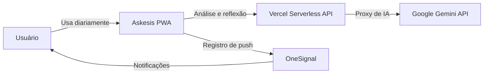
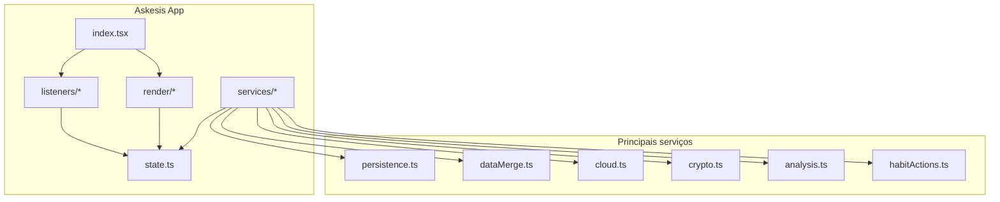
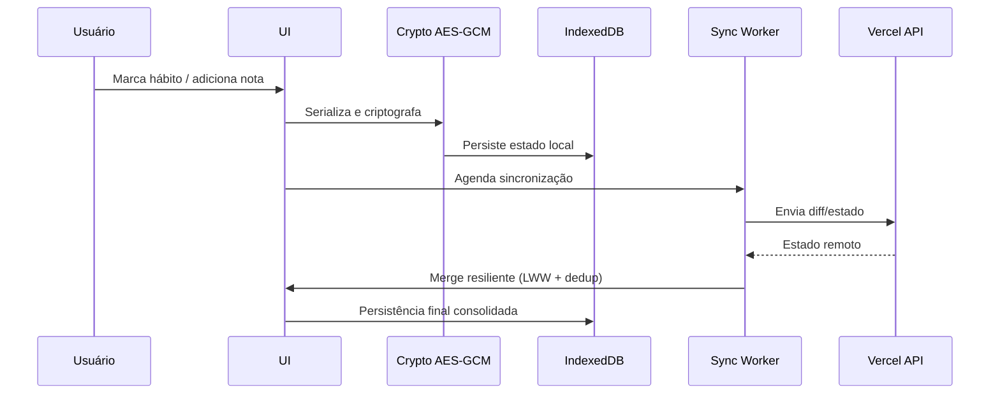
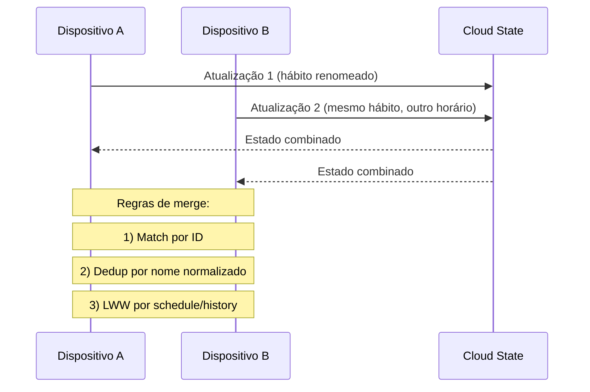
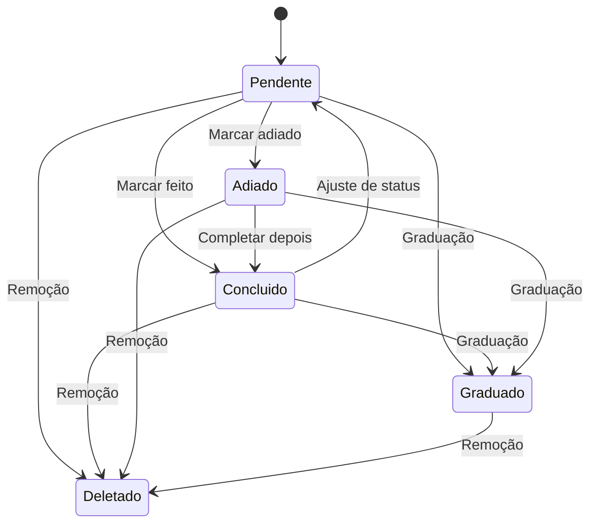

# Arquitetura do Askesis

Este documento consolida a visão arquitetural do sistema em diagramas Mermaid para facilitar onboarding, revisão técnica e evolução do produto.

## 1) Contexto do Sistema (C4 - Nível 1)



## 2) Contêineres (C4 - Nível 2)

```mermaid
flowchart LR
  subgraph Client[Cliente (Browser/PWA)]
    UI[UI + Render]
    SW[Service Worker]
    IDB[(IndexedDB)]
    SYNC[Sync Worker]
    CRYPTO[Crypto AES-GCM]
  end

  subgraph Cloud[Nuvem]
    API[Vercel API]
    AI[Gemini]
    PUSH[OneSignal]
  end

  UI --> IDB
  UI --> CRYPTO
  CRYPTO --> IDB
  UI --> SW
  UI --> SYNC
  SYNC --> API
  API --> AI
  UI --> PUSH
```

## 3) Componentes Internos (C4 - Nível 3)



## 4) Fluxo de Dados (Local-first + Sync)



## 5) Fluxo de Conflito de Sync



## 6) Máquina de Estados do Hábito



## 7) Mapa rápido de módulos (pasta → responsabilidade)

- `render/`: composição visual e atualização de DOM.
- `listeners/`: eventos de interação (toque, drag, swipe, modais).
- `services/`: domínio e infraestrutura (persistência, sync, merge, crypto, análise).
- `api/`: endpoints serverless (analyze/sync) e hardening HTTP.
- `tests/`: cenários de jornada, segurança, resiliência e performance.

## Uso no README

Você pode copiar os blocos Mermaid acima e colar no README conforme a necessidade de profundidade:

- Curto: Contexto + Contêineres.
- Médio: + Fluxo de Dados.
- Completo: todos os diagramas.
