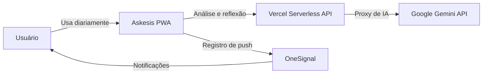
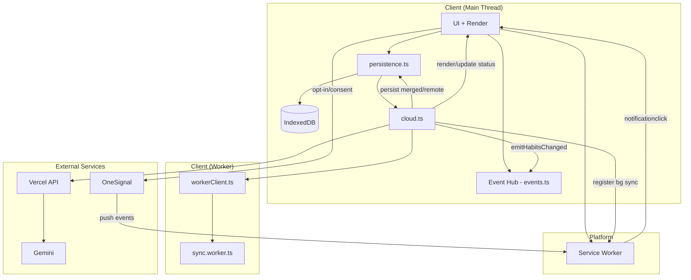
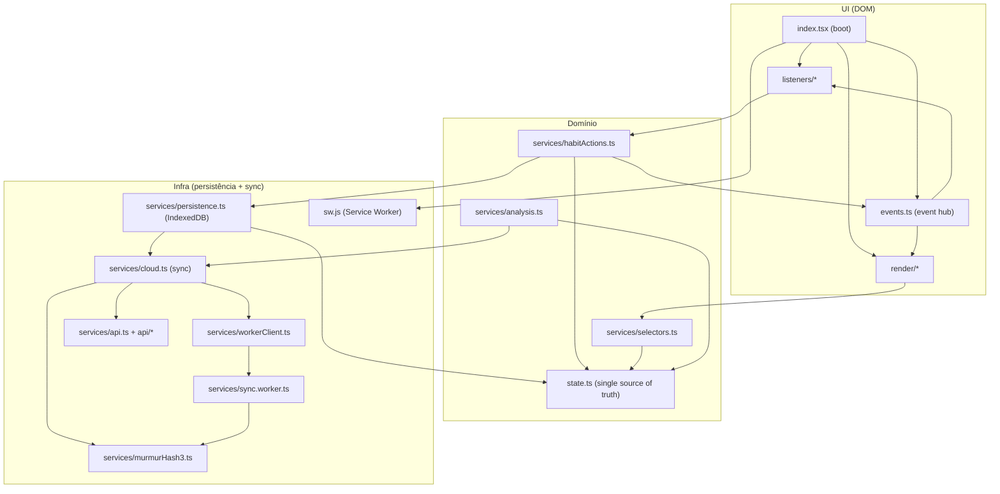
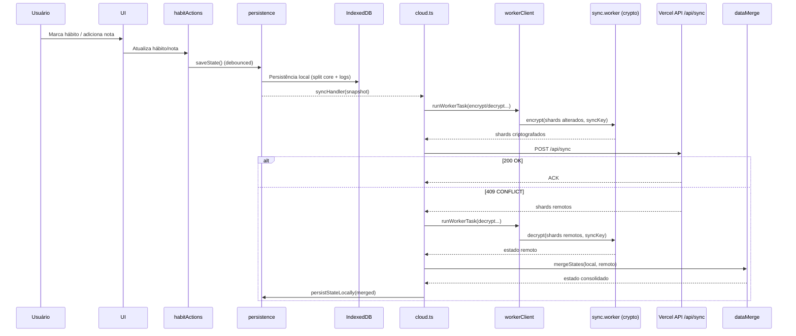
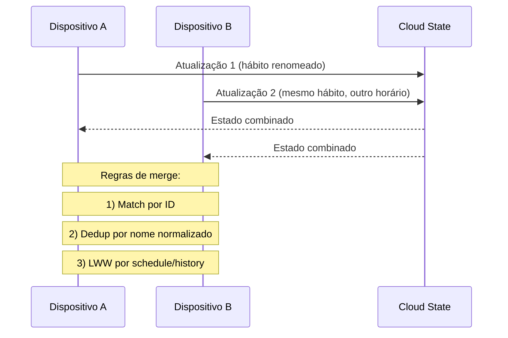

# Arquitetura do Askesis

Este documento consolida a visão arquitetural do sistema em diagramas Mermaid para facilitar onboarding, revisão técnica e evolução do produto.

## 1) Contexto do Sistema (C4 - Nível 1)

## 2) Contêineres (C4 - Nível 2)

## 3) Componentes Internos (C4 - Nível 3)

Leitura rápida: interação entra por `listeners/*`, regra de negócio vive em `habitActions.ts`/`selectors.ts`, estado central em `state.ts`, e persistência/sync ficam em `persistence.ts` + `cloud.ts` + `sync.worker.ts`.

## 4) Fluxo de Dados (Local-first + Sync)

## 5) Fluxo de Conflito de Sync

## 6) Mapa rápido de módulos (pasta → responsabilidade)

- `render/`: composição visual e atualização de DOM.
- `listeners/`: eventos de interação (toque, drag, swipe, modais).
- `services/`: domínio e infraestrutura (persistência, sync, merge, crypto, análise).
- `api/`: endpoints serverless (analyze/sync) e hardening HTTP.
- `tests/`: cenários de jornada, segurança, resiliência e performance.

## Uso no README

Você pode copiar os blocos Mermaid acima e colar no README conforme a necessidade de profundidade:

- Curto: Contexto + Contêineres.
- Médio: + Fluxo de Dados.
- Completo: todos os diagramas.
