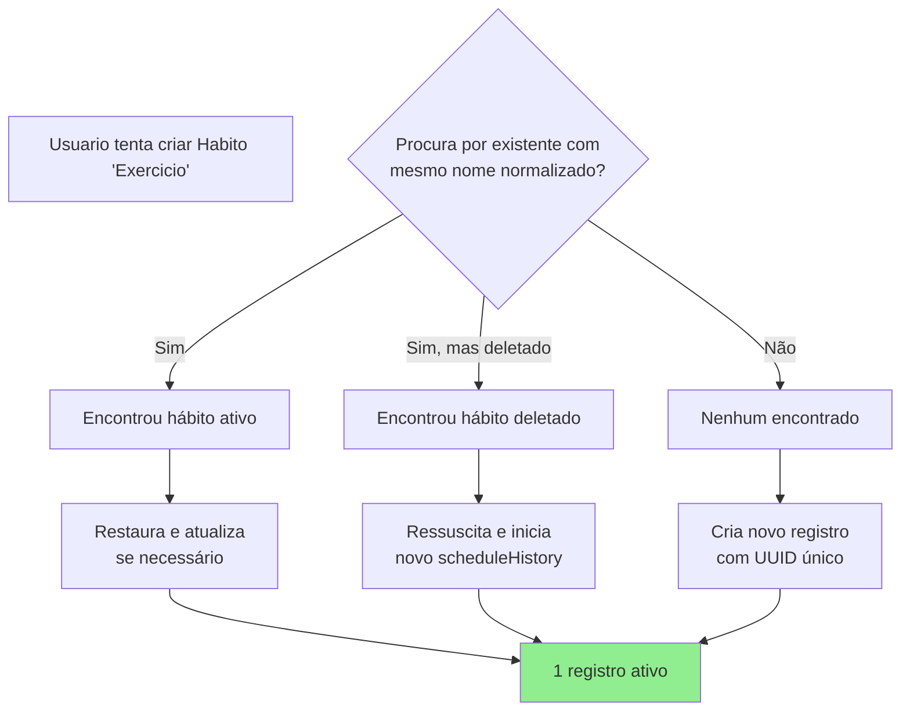

# Testes do Askesis

## Objetivo
Este documento descreve o **estado real atual** da suíte de testes do projeto.

## Para que este arquivo existe
- Mostrar rapidamente se a suíte está saudável (sem depender de histórico de chat/terminal).
- Servir como referência de execução para quem vai abrir PR.
- Evitar divergência entre o que a documentação diz e o que o projeto realmente executa.

Última verificação executada em: **2026-02-20**
Comando usado: `npm test -- --run`

---

## Resumo Atual da Suíte

- **Arquivos de teste:** 26
- **Testes totais:** 399
- **Resultado atual:** 399 passando, 0 falhando
- **Status de arquivos:** 26 passando, 0 falhando

### Status
✅ Suíte totalmente aprovada.

---

## Fluxo Rápido (dia a dia)

### 1) Validar apenas o que você mexeu
```bash
npm test -- --run services/dataMerge.test.ts
```

### 2) Validar a suíte de cenários
```bash
npm run test:scenario
```

### 3) Validar tudo antes de PR
```bash
npm test -- --run
```

---

## Checklist para Pull Request
- [ ] Teste(s) diretamente afetado(s) passando
- [ ] Suíte completa passando (`npm test -- --run`)
- [ ] Se contagem de testes mudou, este README foi atualizado
- [ ] Se novo arquivo `*.test.ts` foi adicionado/removido, inventário atualizado

---

## Inventário Exato (arquivo → testes)

### Cenários (`tests/`)
- `tests/scenario-test-1-user-journey.test.ts` → 3
- `tests/scenario-test-2-sync-conflicts.test.ts` → 5
- `tests/scenario-test-3-performance.test.ts` → 9
- `tests/scenario-test-4-accessibility.test.ts` → 12
- `tests/scenario-test-5-disaster-recovery.test.ts` → 10
- `tests/scenario-test-6-security-pentest.test.ts` → 42
- `tests/scenario-test-7-cloud-network-resilience.test.ts` → 33

### Serviços (`services/`)
- `services/HabitService.test.ts` → 16
- `services/analysis.test.ts` → 5
- `services/api.test.ts` → 14
- `services/cloud.test.ts` → 4
- `services/cloudDataMerge.integration.test.ts` → 1
- `services/crypto.test.ts` → 14
- `services/dataMerge.test.ts` → 27
- `services/habitActions.test.ts` → 29
- `services/importExport.test.ts` → 1
- `services/migration.test.ts` → 20
- `services/persistence.test.ts` → 7
- `services/quoteEngine.test.ts` → 10
- `services/selectors.test.ts` → 23
- `services/stateUIConsistency.test.ts` → 35

### API (`api/`)
- `api/_httpSecurity.test.ts` → 5
- `api/analyze.test.ts` → 2
- `api/sync.test.ts` → 6

### Raiz
- `i18n.test.ts` → 22
- `utils.test.ts` → 44

> Soma total validada: **399 testes**.

---

## Cobertura de Testes (detalhado)

###  Cenário 1: Jornada do Usuário (3)
- Criação de hábitos, marcação de status e notas
- Persistência e recuperação após reload
- Integridade de estado + renderização de DOM

###  Cenário 2: Conflitos de Sincronização (5)
- Merge de bitmasks e reconciliação CRDT-lite
- Prioridade de tombstone (delete vence update)
- Serialização/desserialização e convergência

###  Cenário 3: Performance e Estresse (9)
- Budget de criação, leitura, render e toggles
- Escalabilidade com volume alto de dados
- Serialização de longo histórico com tempo controlado

###  Cenário 4: Acessibilidade (12)
- Navegação por teclado e gerenciamento de foco
- Semântica HTML/ARIA e feedback assistivo
- Validações de contraste e interação acessível

###  Cenário 5: Recuperação de Desastres (10)
- Corrupção de storage e dados parciais
- Quota/erros de persistência e degradação graceful
- Robustez de migração e recuperação de estado

###  Cenário 6: Segurança (42)
- Hardening contra XSS e prototype pollution
- Validação de entrada, injeções e abuso de API
- Cobertura de fluxos críticos de segurança de ponta a ponta

###  Cenário 7: Cloud e Resiliência de Rede (33)
- Falhas de rede, retries, debounce e race conditions
- Consistência eventual em sincronização
- Resiliência em cenários de indisponibilidade parcial

###  Nuclear QA: HabitService (16)
- Fuzzing/property-based para operações de domínio
- Oracle test para validar consistência funcional
- Idempotência, comutatividade e guard clauses

###  Nuclear QA: dataMerge (27)
- Convergência distribuída (split-brain/network partition)
- Deduplicação por identidade com heurísticas seguras
- Roundtrip e invariantes de merge sob cenários extremos

> Observação: esse resumo detalha objetivos por suíte; a fonte de verdade para contagem permanece no inventário acima.

---

## Regras de Unicidade de Hábitos

O sistema implementa **cinco mecanismos complementares** para evitar duplicidade e inconsistência de hábitos:

### 1. **Por ID (Merge de Sync)**
- Quando dois estados são sincronizados, hábitos com o **mesmo `id`** são consolidados em um único registro.
- O histórico (`scheduleHistory`) é mesclado por `startDate`, com prioridade para o hábito vencedor do merge global.
- Implementado em `services/dataMerge.ts` com lógica de `mergeStates()`.

### 2. **Por Nome Normalizado (Deduplicação Automática)**
- Durante o sync, candidatos de deduplicação são avaliados por **identidade normalizada** (nome ou `nameKey`, com remoção de acentos, trim e lowercase).
- A deduplicação por nome **não é sempre automática**: pode ser auto-deduplicada, exigir confirmação ou manter separado, conforme heurísticas de risco (nome genérico, sobreposição de períodos/dados e similaridade estrutural).
- **Remapeamento de dados:** Logs diários (`dailyData`) são automaticamente remapeados para o novo ID consolidado.
- **Exemplo:** Se local tem "Exercício" (id: `habit-1`) e cloud tem "EXERCÍCIO" (id: `habit-2`), o merge tende a consolidar os históricos quando as heurísticas classificam o caso como seguro.

### 3. **Na Edição (Validação de Nome Único)**
- Hoje, a edição **não abre modal de mesclagem por colisão de nome**.
- O fluxo atual de `saveHabitFromModal()` aplica normalização/sanitização de dados e atualiza o hábito alvo.

### 4. **Na Criação (Ressurreição)**
- Ao criar um novo hábito, o sistema procura por um existente com o **mesmo nome normalizado**.
- Se encontrar, **reaproveita** aquele registro (resurrection) em vez de criar um novo.
- Prioridade:
	1. Hábito ativo que cobre a data alvo
	2. Caso contrário, seleciona o candidato mais recente por `startDate`/`createdOn`
- Isso evita criar 2+ registros diferentes para o "mesmo hábito logicamente".

### Fluxo Visual



### Testes de Cobertura

- **`services/dataMerge.test.ts`**: testes de merge/deduplicação no sync (incluindo cenários distribuídos e confirmação de dedup).
- **`services/habitActions.test.ts`**: testes de "resurrection", normalização de `times` e utilitários de deduplicação.
- **`services/migration.test.ts`**: testes de sanitização de `scheduleHistory` (mode/times/frequency) na migração.

### Casos Limites Tratados

| Cenário | Comportamento |
|---|---|
| Dois hábitos com mesmo nome e identidade ambígua | Merge pode manter separados (sem dedup forçada) |
| Hábito ativo com mesmo nome em diferentes horários | Pode exigir confirmação e permanecer separado, conforme heurísticas |
| Nome vazio ou whitespace | Ignorado pela normalização; não gera duplicidade |
| Renomear hábito para nome que já existe | Edição atualiza o hábito sem modal de merge por nome |
| Sincronizar 3+ dispositivos com variações de nome ("Exercicio"/"EXERCÍCIO"/"exercício") | Pode consolidar ou manter separado, conforme heurísticas de dedup |

### 5. **Por TimeOfDay (Unicidade de Horário)**
- O sistema garante que **nenhum hábito aparece 2x ou mais no mesmo horário (Morning/Afternoon/Evening)** em um mesmo dia.
- Deduplicação implementada em **3 camadas defensivas**:
	1. **Na Submissão do Formulário:** `habitActions.ts#saveHabitFromModal()` deduplica `formData.times` antes de salvar.
	2. **Na Migração/Carregamento:** `migration.ts` limpa qualquer dado corrompido durante hidratação de IndexedDB.
	3. **No Merge de Sync:** `dataMerge.ts` deduplica `scheduleHistory[].times` após consolidação de dois estados.
- **Função Utilitária:** `deduplicateTimeOfDay()` exportada em habitActions.ts, reutilizada nos 3 pontos.
- **Implementação:** Set-based deduplication com `O(n)` complexidade, preserva ordem de ingestão.
- **Exemplos:**
	- Usuário seleciona ["Morning", "Afternoon", "Morning"] no modal → Salvo como ["Morning", "Afternoon"]
	- Dados corrompidos em storage com times duplicados → Limpos na próxima abertura do app
	- Merge de 2 dispositivos com diferentes ordens → Resultado deduplicated mantém todos os tempos únicos

| Cenário | Comportamento |
|---|---|
| Usuário seleciona mesmo TimeOfDay 2x na UI | Sistema deduplicará automaticamente na submissão |
| Dados corrompidos em IndexedDB com duplicatas de times | Migração sanitiza ao carregar o estado |
| Sync merge combina times de duas versões | DataMerge normaliza/deduplica `times` após consolidação dos estados |
| Drag-drop tenta mover hábito para TimeOfDay já ocupado | Operação rejeitada (validação em listeners/drag.ts) |

---

## Comandos Disponíveis
(Conferidos em `package.json`)

- `npm test` → roda toda a suíte (`vitest run`)
- `npm run test:scenario` → roda apenas cenários (`tests/scenario-test-*.test.ts`)
- `npm run test:watch` → modo watch
- `npm run test:ui` → interface do Vitest
- `npm run test:coverage` → cobertura

---

## Convenção de Atualização
Sempre que mudar a suíte (novos arquivos, remoção, alteração de contagem), atualizar este README com base em execução real:

```bash
npm test -- --run
```

Atualize também quando:
- houver mudança de scripts de teste em `package.json`;
- um teste for movido de pasta;
- o status global mudar (ex.: falhas temporárias conhecidas).

---